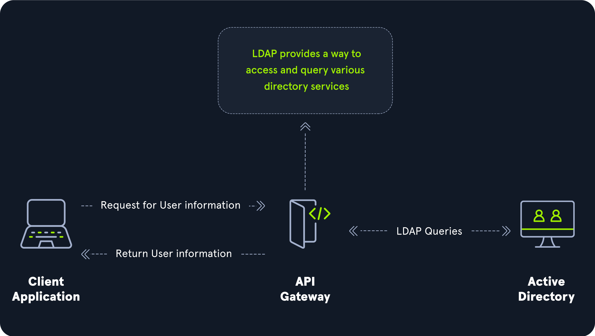

# 389/636 -LDAP/S



---
### Enumeration
With [Impacket](https://github.com/SecureAuthCorp/impacket)'s [ntlmrelayx](https://github.com/SecureAuthCorp/impacket/blob/master/examples/ntlmrelayx.py) it is possible to gather lots of information regarding the domain users and groups, the computers, [ADCS](https://www.thehacker.recipes/ad/movement/adcs/), etc. through a [NTLM authentication relayed](https://www.thehacker.recipes/ad/movement/ntlm/relay) within an LDAP session.
```bash
ntlmrelayx -t "ldap://domaincontroller" --dump-adcs --dump-laps --dump-gmsa
```

The [ldapsearch](https://git.openldap.org/openldap/openldap) (C) tool can also be used.
```bash
# try on both ldap and ldaps, this is first command to run if you dont have any valid credentials.

ldapsearch -x -H ldap://<IP>:<port> 

ldapsearch -x -H ldap://<IP> -D '' -w '' -b "DC=<1_SUBDOMAIN>,DC=<TLD>"
ldapsearch -x -H ldap://<IP> -D '<DOMAIN>\<username>' -w '<password>' -b "DC=<1_SUBDOMAIN>,DC=<TLD>"
#CN name describes the info w're collecting
ldapsearch -x -H ldap://<IP> -D '<DOMAIN>\<username>' -w '<password>' -b "CN=Users,DC=<1_SUBDOMAIN>,DC=<TLD>"
ldapsearch -x -H ldap://<IP> -D '<DOMAIN>\<username>' -w '<password>' -b "CN=Computers,DC=<1_SUBDOMAIN>,DC=<TLD>"
ldapsearch -x -H ldap://<IP> -D '<DOMAIN>\<username>' -w '<password>' -b "CN=Domain Admins,CN=Users,DC=<1_SUBDOMAIN>,DC=<TLD>"
ldapsearch -x -H ldap://<IP> -D '<DOMAIN>\<username>' -w '<password>' -b "CN=Domain Users,CN=Users,DC=<1_SUBDOMAIN>,DC=<TLD>"
ldapsearch -x -H ldap://<IP> -D '<DOMAIN>\<username>' -w '<password>' -b "CN=Enterprise Admins,CN=Users,DC=<1_SUBDOMAIN>,DC=<TLD>"
ldapsearch -x -H ldap://<IP> -D '<DOMAIN>\<username>' -w '<password>' -b "CN=Administrators,CN=Builtin,DC=<1_SUBDOMAIN>,DC=<TLD>"
ldapsearch -x -H ldap://<IP> -D '<DOMAIN>\<username>' -w '<password>' -b "CN=Remote Desktop Users,CN=Builtin,DC=<1_SUBDOMAIN>,DC=<TLD>"

# Get attackable user list
ldapsearch -x -H ldap://10.10.10.161 -D '' -w '' -b "DC=htb,DC=local" "(&(objectClass=user)(!(userAccountControl:1.2.840.113556.1.4.803:=2)))" sAMAccountName | grep "sAMAccountName:" | awk '{print $2}' > users.txt
```

The windapsearch script can be used to enumerate basic but useful information.
```bash
#windapsearch.py
python3 windapsearch.py -d htb.local --dc-ip 10.10.10.161 --custom "objectClass=*"

python3 windapsearch.py --dc-ip <IP address> -u

#for computers
python3 windapsearch.py --dc-ip <IP address> -u <username> -p <password> --computers

#for groups
python3 windapsearch.py --dc-ip <IP address> -u <username> -p <password> --groups

#for users
python3 windapsearch.py --dc-ip <IP address> -u <username> -p <password> --da

#for privileged users
python3 windapsearch.py --dc-ip <IP address> -u <username> -p <password> --privileged-users
```