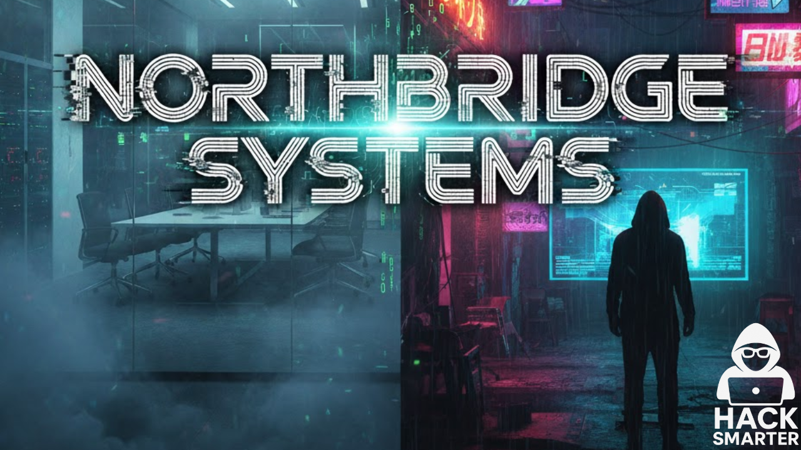

# NorthBridge Systems


## Objective / Scope

NorthBridge Systems is a managed service provider that has engaged the Hack Smarter Red Team to perform a security assessment against a portion of their environment. The assessment is to be conducted from an assumed breach perspective, as you have been provided credentials for a dedicated service account created specifically for this engagement.

Your point of contact at NorthBridge Systems has authorized testing on the following hosts. Any host outside this scope is considered out of scope and should not be accessed.

- NORTHDC01 (Domain controller)
- NORTHJMP01 (Jump box user by the IT team)

The primary objective of the security assessment is to compromise the domain controller (NORTHDC01) in order to demonstrate the effectiveness (or lack thereof) of the recent security hardening activities.

To track your progress in the assessment, there are flags located at C:\Users\Administrator\Desktop on each host.

As you progress through the environment, make sure to document these flags so your point of contact knows you have compromised the environment.

Your success in this assessment will directly inform their future cybersecurity budget! No pressure!

#### [](https://www.hacksmarter.org/courses/1e19584b-4577-402d-a264-d6476d2d1b9b#user-content-starting-credentials)Starting Credentials

```
_securitytestingsvc:4kCc$A@NZvNAdK@
```